# Practical AWS & DevOps Field Guide

A personal AWS learning and engineering knowledge base for beginner and intermediate DevOps learners. It combines simple explanations, classroom analogies, practical commands, architecture reasoning, troubleshooting, labs, and interview preparation.

> This is not official AWS documentation. Console labels, quotas, pricing, and service behavior change. Verify production decisions against current AWS documentation.

## Table of Contents

- [How to Use These Notes](#how-to-use-these-notes)
- [Prerequisites and Setup](#prerequisites-and-setup)
- [AWS Fundamentals](#aws-fundamentals)
- [Global Infrastructure](#global-infrastructure)
- [Compute: EC2, AMI, and EBS](#compute-ec2-ami-and-ebs)
- [Storage: S3 and EFS](#storage-s3-and-efs)
- [Database: RDS](#database-rds)
- [Networking as One System](#networking-as-one-system)
- [Route 53 and DNS](#route-53-and-dns)
- [Load Balancing and Auto Scaling](#load-balancing-and-auto-scaling)
- [CDN, Lambda, WAF, and Shield](#cdn-lambda-waf-and-shield)
- [Identity and Security](#identity-and-security)
- [Monitoring and Audit](#monitoring-and-audit)
- [High Availability, Backup, and DR](#high-availability-backup-and-dr)
- [Infrastructure as Code](#infrastructure-as-code)
- [Practical Labs](#practical-labs)
- [CLI and Command Reference](#cli-and-command-reference)
- [Linux and AWS Troubleshooting](#linux-and-aws-troubleshooting)
- [Architecture Decision Tables](#architecture-decision-tables)
- [Interview and Scenario Questions](#interview-and-scenario-questions)
- [Production Checklist](#production-checklist)
- [Console Usage and Durable Verification](#console-usage-and-durable-verification)

## How to Use These Notes
[Main menu](#table-of-contents)

Read the fundamentals first, then follow the service relationships rather than treating each AWS service as an isolated product. For every design ask:

1. What is the request or data flow?
2. Which identity is making each call?
3. Which network path is used?
4. What happens when an instance, AZ, dependency, or Region fails?
5. How will the system be monitored, restored, scaled, and paid for?

### Lab and production labels

**LAB / LEARNING:** a disposable exercise designed to demonstrate a concept.

**PRODUCTION RECOMMENDATION:** a baseline that still requires workload-specific review.

Never commit real credentials, private keys, tokens, database passwords, account IDs, public IPs, endpoints, or resource IDs. Use placeholders such as `<ACCESS_KEY_ID>`, `<SECRET_ACCESS_KEY>`, `<AMI_ID>`, `<VPC_ID>`, `<SUBNET_ID>`, `<INSTANCE_ID>`, `<RDS_ENDPOINT>`, `<BUCKET_NAME>`, `<KEY_PAIR_NAME>`, and `<AWS_ACCOUNT_ID>`.

### Current-AWS verification note

Verify pricing, free-tier allowances, quotas, service limits, supported Regions, instance types, runtime versions, CLI options, and console behavior against current AWS documentation before using an example in production. This knowledge base intentionally avoids temporary prices and quotas.

## Prerequisites and Setup
[Main menu](#table-of-contents)

Complete the general setup once, then use the lab-specific prerequisites before each exercise. Verify current installation commands, supported operating systems, service limits, pricing, and Regions against current vendor documentation because they change.

### Knowledge prerequisites

- Basic Linux commands and file permissions
- Basic networking: IP addresses, ports, DNS, HTTP, and TLS
- Git basics
- YAML and JSON basics
- Basic cloud concepts: regions, identity, networking, and billing

### AWS prerequisites

- An AWS account or approved sandbox with billing alerts
- A selected Region and awareness that most resources are regional
- AWS CLI and an approved authentication method
- Appropriate IAM permissions for the specific lab
- Basic IAM understanding, including roles and least privilege

### Local-machine prerequisites

The whole knowledge base requires a terminal, browser, text editor, AWS CLI, and an authentication method. Specific labs may additionally require Git, an SSH client or Systems Manager Session Manager, Terraform, a database client, or Linux utilities. Do not install every tool for every lab.

### AWS CLI and authentication setup

**Why you need it:** The CLI is the durable way to inspect and automate many examples in this README.

- **Windows:** install AWS CLI v2 using the current official AWS installer, then open a new PowerShell window.
- **Ubuntu/Debian x86_64:** use the current official AWS CLI v2 installer; this example downloads the current official archive and may need adjustment for ARM.
- **Ubuntu/Debian:** distribution packages may lag behind the supported v2 release.
- **RHEL/Amazon Linux:** use the current official AWS CLI v2 installer or the distribution-supported package where the version is acceptable.

```powershell
msiexec.exe /i https://awscli.amazonaws.com/AWSCLIV2.msi
```

```bash
curl "https://awscli.amazonaws.com/awscli-exe-linux-x86_64.zip" -o "awscliv2.zip"
unzip awscliv2.zip
sudo ./aws/install
```

Use the current official installation page for ARM, macOS, or a newer installer path. On Windows, run the installer from an elevated terminal only when required by the installer and reopen the terminal afterward.

```bash
aws --version
aws sts get-caller-identity
```

For people, prefer IAM Identity Center or federation. Configure a profile with `aws configure sso`, then authenticate with `aws sso login --profile <PROFILE_NAME>`. For EC2 and AWS services, prefer IAM roles. For automation, prefer temporary role assumption or OIDC rather than long-lived access keys. Common issues are a wrong profile, wrong Region, expired SSO session, or missing IAM permission.

**LAB / LEGACY LEARNING:** `aws configure` with restricted temporary or disposable credentials explains local CLI configuration, but do not commit credentials or make long-lived access keys the normal workload pattern.

### Git and text tools

**Why you need them:** Git retrieves lab application code and tracks configuration; a text editor such as Vim edits Linux configuration files.

- **Windows:** install Git for Windows from the official Git distribution; use PowerShell, Git Bash, or Windows Terminal.
- **Ubuntu/Debian:** `sudo apt update && sudo apt install -y git vim`
- **RHEL/Amazon Linux:** `sudo dnf install -y git vim` where `dnf` is available; older systems may use `yum`.

```bash
git --version
vim --version
```

In Vim, press `i` to insert, then `Esc` and `:wq` to save. Common issues are editing the wrong file, insufficient privileges, and forgetting to validate a service configuration before reloading it.

### SSH and Systems Manager access

An SSH client is normally built into modern Windows, macOS, Linux, and most EC2 images. Verify with `ssh -V`. Use `ssh -i <KEY_FILE> <OS_USER>@<PUBLIC_IP>` only for a controlled lab; never paste private-key contents into another server. For production-oriented access, install/configure the SSM Agent where the image does not already include it, attach an instance role with the required Systems Manager permissions, and use the AWS-provided Session Manager plugin or Console integration. Verify with `aws ssm describe-instance-information`.

Session Manager requires the instance to reach the Systems Manager endpoints through internet/NAT or VPC endpoints, and the role and agent must be healthy. It can remove the need for inbound SSH.

### Lab software setup

Install only when the lab requires it:

| Tool | Why it is used | Setup and verification |
|---|---|---|
| Nginx | Serves the EC2 web-server labs | Ubuntu/Debian: `sudo apt update && sudo apt install -y nginx`; RHEL/Amazon Linux: `sudo dnf install -y nginx` where supported; verify `nginx -v` and `systemctl status nginx` |
| MySQL client | Connects to the RDS MySQL lab | Ubuntu/Debian: `sudo apt update && sudo apt install -y mysql-client`; RHEL/Amazon Linux package names vary by repository and engine version, so use the current MySQL client package guidance; verify `mysql --version` |
| EFS NFS utilities | Mounts EFS from Linux | Ubuntu/Debian: `sudo apt install -y nfs-common`; RHEL/Amazon Linux: `sudo dnf install -y amazon-efs-utils` or the supported NFS utilities; verify `mount.nfs4 -V` |
| CloudWatch agent | Sends selected OS metrics and logs | Download the current package for the OS from AWS documentation, install it, apply a least-privilege role/configuration, and verify the agent service and log group |
| `curl` | Tests HTTP endpoints | Usually preinstalled; Ubuntu/Debian: `sudo apt install -y curl`; verify `curl --version` |
| `dig` | Tests DNS | Ubuntu/Debian: `sudo apt install -y dnsutils`; RHEL/Amazon Linux: `sudo dnf install -y bind-utils`; verify `dig -v` |
| `htop` | Interactive process inspection | Ubuntu/Debian: `sudo apt install -y htop`; RHEL/Amazon Linux: `sudo dnf install -y htop` where available; verify `htop --version` |
| `stress` | Controlled lab load generation | Ubuntu/Debian: `sudo apt install -y stress`; use only on disposable instances and verify `stress --version` |

Package names and availability vary by distribution. Never run load generation on production without an approved test plan.

### Terraform setup

**Why you need it:** Terraform is used in the foundational IaC comparison and is optional for the CloudFormation labs.

- **Windows:** install the current Terraform release from HashiCorp or an approved package manager, then reopen the terminal.
- **Ubuntu/Debian and RHEL/Amazon Linux:** use HashiCorp's current package-repository instructions or the official binary; do not assume an old distribution package is current.

```bash
terraform version
```

Common issues are a missing `PATH` entry, an outdated provider lock file, credentials pointing to the wrong profile, and running `terraform destroy` in the wrong directory.

## AWS Fundamentals
[Main menu](#table-of-contents)

### What is AWS?

AWS provides on-demand compute, storage, networking, security, databases, monitoring, and managed application services through APIs, the Console, CLI, SDKs, and Infrastructure as Code.

**Analogy:** a city provides roads, electricity, buildings, and services; AWS provides shared infrastructure while you choose how much to manage.

Use AWS when a team needs on-demand capacity, managed services, global reach, automation, or usage-based infrastructure. AWS is not automatically cheaper or simpler; data transfer, NAT, logging, idle resources, and poor sizing can dominate cost.

### DevOps and the SDLC

DevOps supports the software development lifecycle:

```text
PLAN -> CODE -> BUILD -> TEST -> DEPLOY -> OPERATE -> MONITOR
```

Deployment means installing and releasing an application to a target environment. DevOps is broader than deployment: it also includes repeatable changes, security, feedback, observability, and recovery.

### How AWS creates a resource

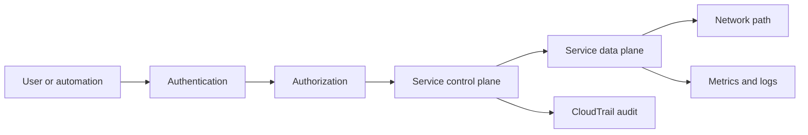

Authentication identifies the caller. Authorization decides what that caller can do. The control plane accepts configuration requests; the data plane performs the service operation. Networking carries the request, monitoring reports health, and CloudTrail records API activity.

### Well-Architected questions

- **Operational excellence:** Can the team deploy, observe, and recover the workload consistently?
- **Security:** Are access, encryption, secrets, and network exposure minimized?
- **Reliability:** What happens when an instance, AZ, dependency, or Region fails?
- **Performance efficiency:** Is the service and data path appropriate for the workload?
- **Cost optimization:** Are idle resources, data transfer, NAT, storage, and logs visible?
- **Sustainability:** Are resources right-sized and unnecessary work avoided?

**Scenario question:** A team wants to deploy faster but production changes frequently cause outages. What should you improve first?

**Answer:** Make changes repeatable through Infrastructure as Code and pipelines, add validation and change review, define rollback, and monitor the deployment and application.

## Global Infrastructure
[Main menu](#table-of-contents)

### Region, Availability Zone, and scope

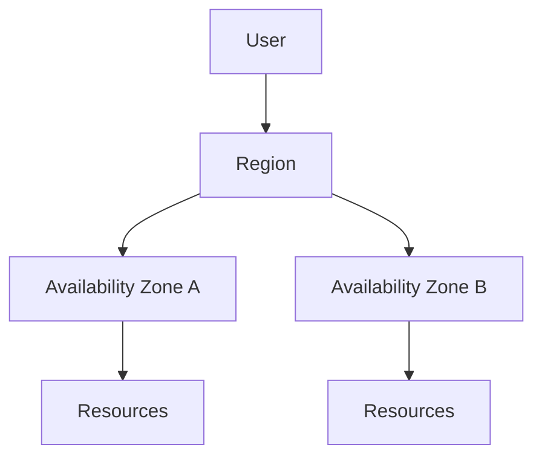

A **Region** is a geographic area. An **Availability Zone** is an isolated location within a Region with independent failure domains and redundant connectivity.

- **Zonal:** tied to one AZ, such as an EBS volume.
- **Regional:** designed within one Region, such as a VPC or an S3 bucket placement.
- **Global or distributed:** delivered across locations, such as Route 53 and CloudFront.

Multi-AZ improves availability during an AZ failure. It does not automatically protect against a regional event; that requires a disaster-recovery design.

**Scenario question:** An application is deployed in one AZ and that AZ becomes unavailable. What does a second Region alone solve?

**Answer:** Nothing automatically. The workload needs resources, data, identity, networking, DNS, and a tested recovery process in the second Region. Multi-AZ is the nearer-term control for an AZ failure.

## Compute: EC2, AMI, and EBS
[Main menu](#table-of-contents)

### EC2

Amazon Elastic Compute Cloud provides virtual servers called instances.

**Category:** Compute. **Scope:** an instance is zonal; an AMI or launch template can support repeatable launches in compatible AZs and Regions.

**Analogy:** EC2 is a rented server room. The instance type is the hardware profile, the AMI is the starting disk image, and a security group is the network door policy.

Use EC2 when you need OS-level control, long-running processes, custom agents, or software that does not fit a managed or serverless model. Consider Lambda or managed containers when server maintenance is not valuable.

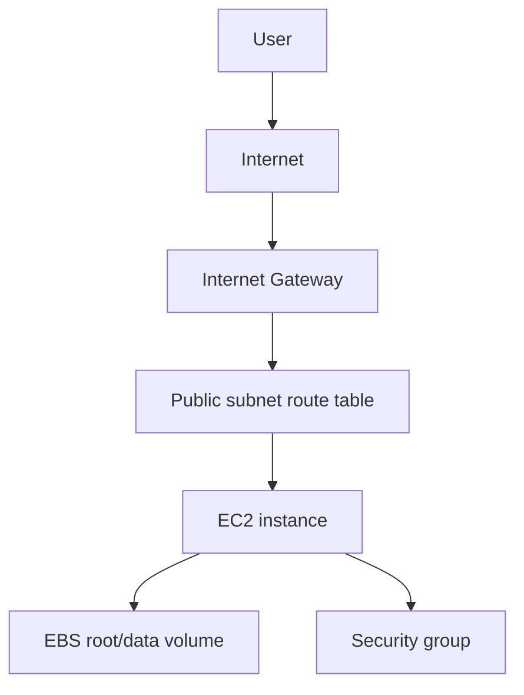

An Internet Gateway alone does not make an instance public. Direct internet reachability also needs a route, a public IPv4 address or supported public path, and security controls that allow the traffic.

### Creating an EC2 instance

1. Select a trusted AMI and instance type.
2. Select a VPC and subnet; decide whether a public IP is actually needed.
3. Attach an IAM instance role instead of storing access keys on disk.
4. Allow only required ports in the security group. Prefer Systems Manager or a controlled source over public SSH.
5. Select encrypted EBS volumes and a key pair only if the selected access method needs SSH.
6. Use user data or an image pipeline for repeatable bootstrap.
7. Tag owner, environment, application, and cleanup information.

**Console orientation - UI may change:** supply the choices above, then verify the resulting subnet, route table, security group, role, volumes, and system/status checks.

```bash
aws ec2 describe-instances --instance-ids <INSTANCE_ID> --query 'Reservations[].Instances[].{State:State.Name,PrivateIp:PrivateIpAddress,PublicIp:PublicIpAddress}'
```

Purpose: verify state and addresses. Expected result: a structured result for the instance. Common mistake: querying the wrong Region or lacking `ec2:DescribeInstances`.

### AMI and EBS

- **AMI:** a launchable server image that references snapshots and launch metadata. Use it for repeatable provisioning, golden images, migration, and rollback.
- **EBS snapshot:** a point-in-time backup of one EBS volume. Use it for volume recovery, migration, or a source for an AMI.
- **AWS Backup:** policy-based backup orchestration with retention, vaults, and copies.

The useful choice depends on the recovery or provisioning requirement, not on the number of files. EBS volumes are AZ-specific. Snapshots are regional by default and can be copied across Regions.

Encrypt EBS at rest with KMS, patch the OS, restrict ingress, and use roles. A single EBS-backed instance is not automatically highly available. Use an Auto Scaling group and multiple AZs for horizontal resilience.

### EBS, EFS, and S3 comparison

| Feature | EBS | EFS | S3 |
|---|---|---|---|
| Model | Block storage | Shared file storage | Object storage |
| Access | Attached to EC2 | NFS from multiple clients | API/HTTP |
| Scope | Volume is zonal | Regional file system with AZ mount targets | Regional bucket placement |
| Scaling | Chosen volume type and size | Elastic file capacity | Elastic object capacity |
| Common use | OS, database, low-latency disk | Shared files and home directories | Backups, media, logs, static assets |
| Recovery | Snapshots and AWS Backup | Backup and replication options | Versioning, replication, lifecycle |

### EC2 web-server lab

**Objective:** install Nginx on a disposable EC2 instance and serve a test site.

```bash
sudo -i
apt update
apt install nginx -y
git clone https://github.com/Ironhack-Archive/online-clone-amazon.git
mv online-clone-amazon/* /var/www/html/
systemctl status nginx
curl -I http://localhost
```

**Verification:** confirm instance status checks, `systemctl status nginx`, local `curl`, and an external HTTP request if the network path allows it.

**Failure simulation:** change a disposable Nginx listener or deny rule, test it, then restore it. Do not test against production.

**Cleanup:** terminate the instance, delete unattached EBS volumes and Elastic IPs, and review charges. A stopped instance may still incur EBS charges.

### EC2 correction

> **Original idea:** EC2 is simply an AWS server and a key pair provides the login.
>
> **Improved explanation:** EC2 is a configurable virtual machine. A key pair is one SSH authentication option; IAM roles, Systems Manager, OS accounts, and network controls also affect access.
>
> **Why:** Treating a key pair as the whole security model encourages exposed SSH and long-lived credentials.

**Scenario question:** An EC2 instance is running but the website is unreachable. What do you check?

**Answer:** Check the application locally, listener port, service logs, instance status, public address, subnet route, Internet Gateway path, security group, NACL, DNS, and load-balancer health in that order.

## Storage: S3 and EFS
[Main menu](#table-of-contents)

### S3

Amazon Simple Storage Service stores objects in buckets. An object has data, a key, and metadata. A bucket is not a traditional filesystem folder; prefixes make keys look folder-like.

**Category:** Object storage. **Scope:** bucket placement is regional, with global access paths available through AWS endpoints and distribution services.

Use S3 for images, audio, video, documents, logs, backups, and static assets. Do not use it as a POSIX filesystem when applications need file locking or low-latency block access.

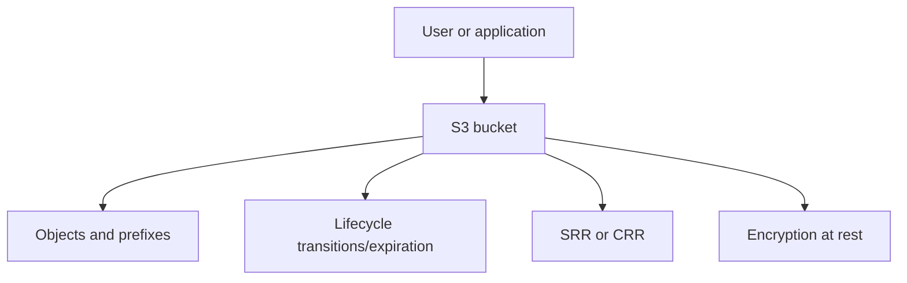

#### S3 CLI examples

```bash
aws s3 ls
aws s3 cp ./file.txt s3://<BUCKET_NAME>/file.txt
aws s3api head-object --bucket <BUCKET_NAME> --key file.txt
aws s3 presign s3://<BUCKET_NAME>/file.txt --expires-in 600
```

- `aws s3 ls`: lists accessible buckets or objects. An empty result does not prove a bucket does not exist.
- `cp`: uploads an object; the caller needs `s3:PutObject` for the target.
- `head-object`: verifies metadata and existence. Access denial can look like not-found.
- `presign`: creates a temporary bearer URL using the signer's permissions. Protect it and keep expiry short.

Presigned URL limits depend on the generation method; do not treat a console-specific range as universal. CLI/SDK-generated URLs can commonly be valid for up to seven days when credentials support it.

#### Replication, lifecycle, and batch operations

- **SRR:** Same-Region Replication for compliance, operational isolation, or account separation.
- **CRR:** Cross-Region Replication for regional recovery, compliance, or regional data placement.
- Replication is asynchronous. Enable versioning and configure the replication IAM role. Existing objects may require an explicit batch operation or migration.
- Lifecycle rules transition or expire objects based on age, prefix, tags, or versions.
- Transfer Acceleration can improve long-distance uploads through edge locations and has extra charges; measure it.
- S3 Batch Operations applies an action to a manifest of many objects.

**LAB ONLY:** public S3 website hosting or broad bucket permissions can demonstrate concepts. Production applications should normally use private buckets with CloudFront origin access control or presigned access.

#### S3 security and verification

Use Block Public Access by default, least-privilege bucket policies, versioning where recovery matters, SSE-S3 or SSE-KMS, TLS, and CloudTrail data events where object-level auditing is required. S3 Standard is designed for high durability, commonly expressed as `99.999999999%`, but durability is not availability and does not eliminate deletion, overwrite, or account-risk concerns.

Verify bucket Region, IAM identity, bucket policy, object key, encryption permissions, version ID, and replication status. CRR is not the general answer for cross-account sharing or user latency; use resource policies, presigned URLs, or CloudFront according to the requirement.

**Cleanup:** delete test objects and versions, remove replication rules, delete test buckets, disable unused acceleration, and review replication and request charges. Versioned buckets require deleting object versions and delete markers.

**Scenario question:** A user in another continent reports slow S3 downloads. Should you immediately enable CRR?

**Answer:** No. Measure the request path first. CloudFront is usually the latency control for global reads; CRR is mainly for resilience, compliance, or regional data placement.

### EFS

Amazon Elastic File System is managed, elastic NFS file storage mounted by multiple clients.

**Category:** File storage. **Scope:** regional file system with AZ-specific mount targets.

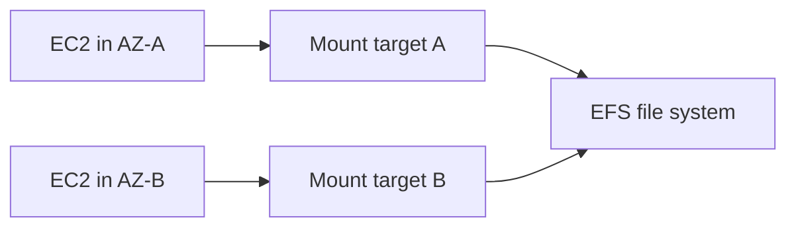

Use EFS for shared content, user home directories, and applications designed for NFS. Do not use it automatically for every file workload; latency, throughput, permissions, locking, and cost may favor EBS or S3.

#### EFS lab

Prerequisites: two disposable EC2 instances in different AZs, mount targets in their subnets, and a security group allowing NFS TCP 2049 from the EC2 security group.

```bash
sudo apt update
sudo apt install nginx nfs-common -y
sudo mkdir -p /var/www/html/shared
sudo mount -t nfs4 -o nfsvers=4.1,hard,timeo=600,retrans=2,noresvport <EFS_DNS_NAME>:/ /var/www/html/shared
df -h
touch /var/www/html/shared/created-on-server-a
```

Verify the file from the second instance. EFS can be used with an Auto Scaling group through user data or lifecycle automation; every launched instance still needs the mount configuration and network access.

Use encryption, POSIX permissions, access points where useful, and security groups limited to NFS from approved clients. **Cleanup:** unmount clients, delete test files, remove mount targets and the file system, and remove unused security groups.

**Scenario question:** One EC2 instance can mount EFS, but another cannot. What should you check?

**Answer:** Check the second instance's AZ mount target, DNS resolution, NFS TCP 2049 security-group rules, subnet routes, POSIX permissions, and mount configuration.

## Database: RDS
[Main menu](#table-of-contents)

Amazon RDS is a managed relational database service. AWS manages much of provisioning, patching, backups, monitoring, and failure handling while the team chooses the engine, instance class, storage, schema, access model, and maintenance window.

**Category:** Database. **Scope:** a DB instance is placed in an AZ; Multi-AZ deployments span AZs.

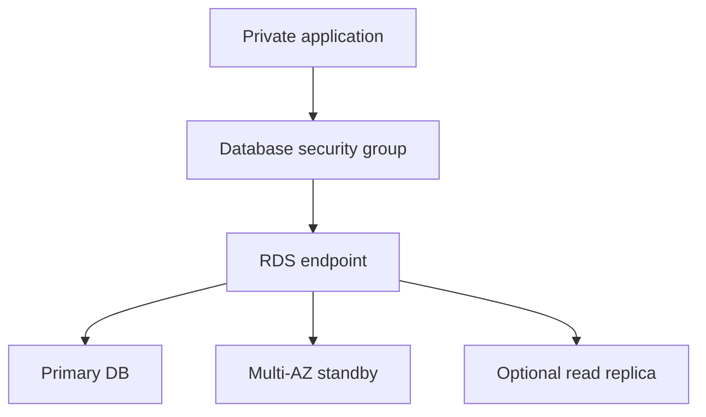

Use RDS when the application needs a supported relational engine and managed operations. Do not expose a database directly to the internet. Specialized engines or highly custom control may require another service.

### RDS configuration

Choose engine/version, instance class, storage and autoscaling limits, VPC/subnet group, security group, encryption, backup retention, maintenance window, monitoring, and Secrets Manager integration. Permit database traffic only from the application security group, never from `0.0.0.0/0` in a production design.

### Multi-AZ versus read replica

- **Multi-AZ:** primarily availability and failover. The standby is not the normal read-scaling target.
- **Read replica:** asynchronous copy for read scaling and selected recovery or migration patterns. Promotion is explicit; deleting the source does not automatically make every replica the production primary.

### EC2-to-RDS lab

1. Place RDS in private subnets with a DB subnet group.
2. Allow TCP 3306 to the RDS security group only from the EC2 application security group.
3. Store the master secret in Secrets Manager and retrieve it through the approved role.
4. Install a MySQL client on the EC2 host.

```bash
sudo apt update
sudo apt install mysql-client -y
mysql -u <DB_USER> -h <RDS_ENDPOINT> -p
```

Use a prompt for `<DB_PASSWORD>`; never put a real password in shell history or a committed SQL file.

```sql
CREATE DATABASE <DATABASE_NAME>;
SHOW DATABASES;
USE <DATABASE_NAME>;
SELECT 1;
```

Verify DNS, the security-group path, TLS settings, authentication, and a test query. Monitor CPU, storage, connections, latency, replica lag, free storage, failed connections, and failover events.

**Failure simulation:** remove the EC2-to-RDS rule in a sandbox and prove the timeout, then restore it. **Cleanup:** delete the test DB or disable deletion protection only in the lab, remove snapshots according to retention, delete test secrets, and remove unused security groups.

**Scenario question:** RDS has high read traffic but must remain available during an AZ failure. What combination should you consider?

**Answer:** Use Multi-AZ for availability and failover, and consider read replicas for read scaling. They solve different problems.

## Networking as One System
[Main menu](#table-of-contents)

### Mental model

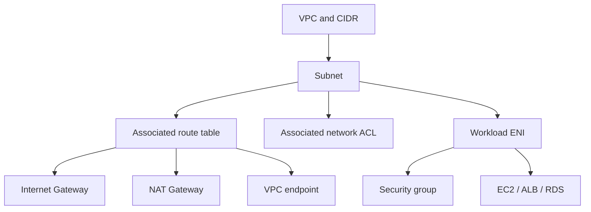

A VPC is an isolated regional network. CIDR defines its address range and a subnet is a range in one AZ. Subnets are associated with route tables and network ACLs. Workload network interfaces live inside subnets and receive security-group rules. Route tables determine paths through an Internet Gateway, NAT Gateway, or VPC endpoint; these components are related controls and destinations, not a single literal packet-processing chain. Security groups filter network interfaces statefully; NACLs filter subnet boundaries statelessly with ordered allow/deny rules.

### Public and private subnet flow

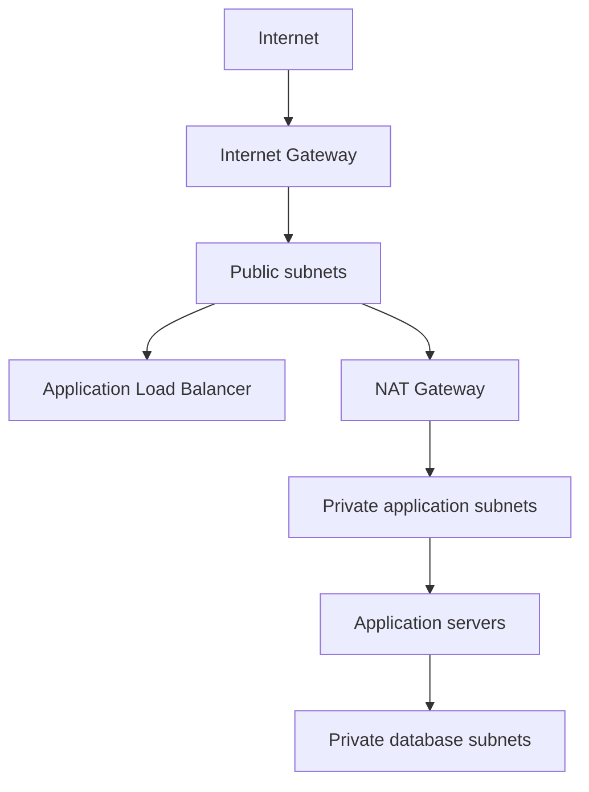

A **public subnet** is a subnet whose associated route table contains a route to an Internet Gateway. A public subnet does not automatically make every resource inside it publicly reachable. For direct IPv4 internet connectivity, an EC2 resource generally needs an appropriate route to an Internet Gateway, a public IPv4 address or Elastic IP, security-group rules, permitted NACL rules, and an application actually listening on the required port.

A **private subnet** does not have a direct route to an Internet Gateway. Private IPv4 resources can use a NAT Gateway in a public subnet for outbound internet connections; NAT Gateway does not provide unsolicited inbound connectivity. A database subnet is normally private.

**IPv6 note:** NAT Gateway is primarily an IPv4 mechanism. IPv6 resources use IPv6 routes and egress controls such as an egress-only Internet Gateway where appropriate. Do not teach “private internet access always means NAT Gateway”; choose the path based on address family and security requirements.

For a user request, DNS resolves a name, the request reaches a public load balancer, the load balancer selects a healthy target, and the application reaches private dependencies through private routes and security groups. For private outbound updates, the instance route points to NAT, NAT uses the IGW, and return traffic comes back through the established stateful flow. NAT does not accept unsolicited inbound connections.

### Components and trade-offs

- **Internet Gateway:** VPC attachment that enables internet routing for public resources; it is not a firewall.
- **NAT Gateway:** managed outbound translation for private IPv4 resources. Deploy per AZ for resilience; remember hourly and data-processing charges.
- **VPC endpoint:** private connectivity to supported AWS services. Gateway endpoints for S3/DynamoDB avoid a NAT path; interface endpoints use private ENIs and cost money.
- **Elastic IP:** static public IPv4 address for supported resources; it is not an HA strategy.
- **VPC peering:** direct private connection between two VPCs. It is non-transitive and requires non-overlapping CIDRs and routes.
- **Transit Gateway:** regional hub for many VPCs and networks. It centralizes routing and scales better than a mesh, with attachment and data-processing cost.

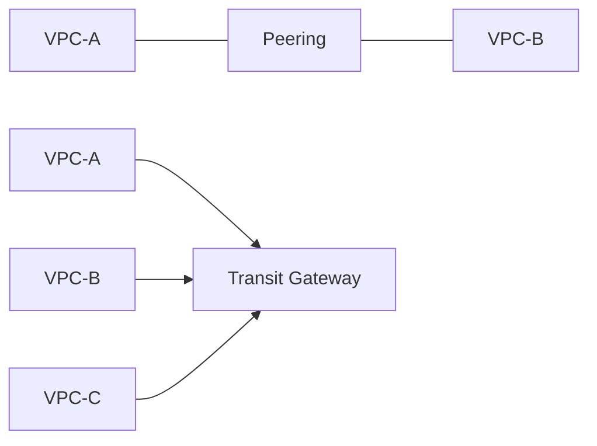

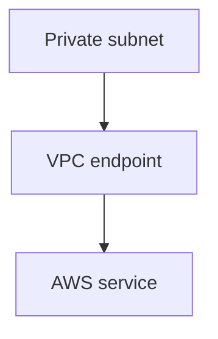

### Network verification

```bash
aws ec2 describe-route-tables --filters Name=vpc-id,Values=<VPC_ID>
aws ec2 describe-security-groups --group-ids <SECURITY_GROUP_ID>
aws ec2 describe-network-acls --filters Name=vpc-id,Values=<VPC_ID>
```

Check subnet association, route target/state, security-group ingress and egress, NACL return rules, DNS, and destination service policies. VPC Flow Logs help when the route appears correct but traffic is rejected or missing.

**Correction:** VPC peering is not automatically transitive. If VPC-A peers with B and B peers with C, A does not automatically reach C through B.

**Scenario question:** A private application can reach its database but cannot download OS updates. What should you inspect?

**Answer:** Check the private subnet route to a NAT Gateway or required VPC endpoint, the NAT subnet route to an Internet Gateway, security-group egress, NACL return rules, DNS, and destination policies.

## Route 53 and DNS
[Main menu](#table-of-contents)

Amazon Route 53 is a managed DNS and traffic-management service.

**Category:** Networking. **Scope:** global DNS service with regional resources such as health checks and routing targets.

### Why and when

Use Route 53 to resolve application names, register domains, perform health-check-based routing, and direct users toward healthy or appropriate endpoints. Do not treat DNS as an instant failover mechanism: resolvers cache answers according to TTL, and the application, certificates, target health, and dependencies must also be ready.

### Architecture and routing

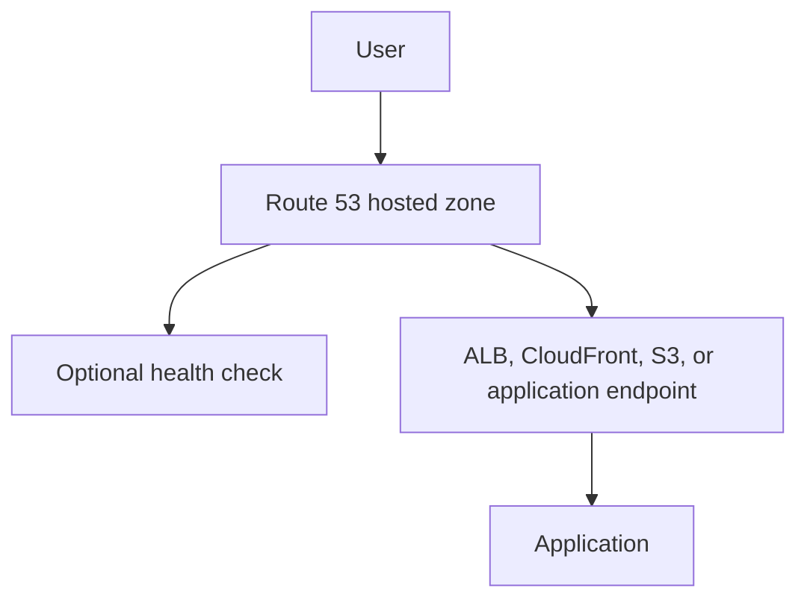

A public hosted zone answers internet DNS queries. A private hosted zone answers queries from associated VPCs. Common routing policies include simple, weighted, latency-based, failover, geolocation, and multivalue answers. Choose a policy based on traffic, health, residency, and recovery requirements rather than assuming DNS load balances application connections.

### Practical verification

```bash
dig <DOMAIN_NAME>
dig <DOMAIN_NAME> +short
aws route53 list-hosted-zones-by-name --dns-name <DOMAIN_NAME>
```

Check the record name/type/value, hosted-zone visibility, alias target, health-check state, TTL, resolver cache, and certificate. An ALB or CloudFront alias is generally preferable to hardcoding a changing IP address.

### Security, availability, and cost

Use least-privilege Route 53 permissions, protect domain-registration access with MFA, restrict private hosted-zone associations, and monitor changes with CloudTrail. Use health checks and a tested failover design for availability. DNS queries, hosted zones, health checks, and domain registration have separate cost considerations.

**Interview question:** What does Route 53 do in a highly available web architecture?

**Answer:** It resolves the application name and can route users toward an ALB or CloudFront distribution, optionally using health checks and a failover policy. It does not replace multi-AZ compute, application health checks, or a DR plan.

**Scenario question:** DNS failover changed to the backup endpoint, but some users still reach the old endpoint. Why?

**Answer:** Recursive resolvers and clients may still have the old record cached until its TTL expires. Verify authoritative answers, TTL, health-check state, and the backup application's readiness.

## Load Balancing and Auto Scaling
[Main menu](#table-of-contents)

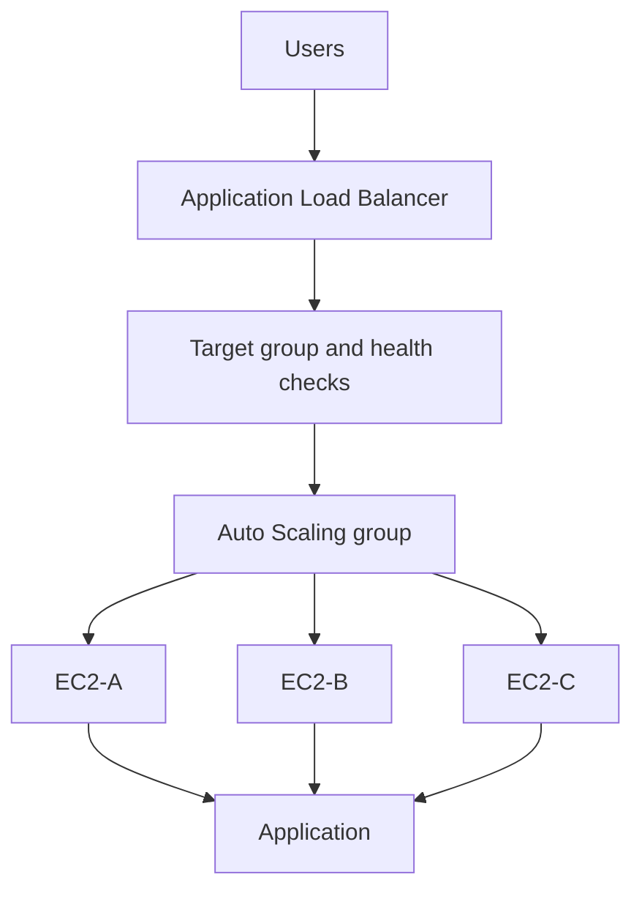

### Load balancer types

- **ALB:** Layer 7 HTTP/HTTPS routing, host/path rules, redirects, and HTTP-aware health checks.
- **NLB:** Layer 4 TCP/UDP/TLS handling for high throughput, static IP needs, or non-HTTP protocols.
- **Gateway Load Balancer:** inserts and scales virtual network appliances using GENEVE.
- **Classic Load Balancer:** legacy; do not select it as the default for new designs.

A target group contains targets and health-check settings. The load balancer sends traffic only to healthy targets. Stickiness binds a client to a target using cookies; it is a session trade-off, not a general load-balancing algorithm.

### Auto Scaling behavior

An ASG maintains **desired capacity** between **minimum** and **maximum** capacity. A launch template defines the AMI, instance type, role, security groups, storage, user data, and launch settings. Policies can be target tracking, step/dynamic, scheduled, or predictive where suitable. Instance warmup lets a new target initialize before another scale decision.

**Horizontal scaling** adds or removes instances. **Vertical scaling** changes an individual instance size and can require interruption. An ASG is primarily a horizontal replacement and scaling mechanism.

### ALB and ASG relationship

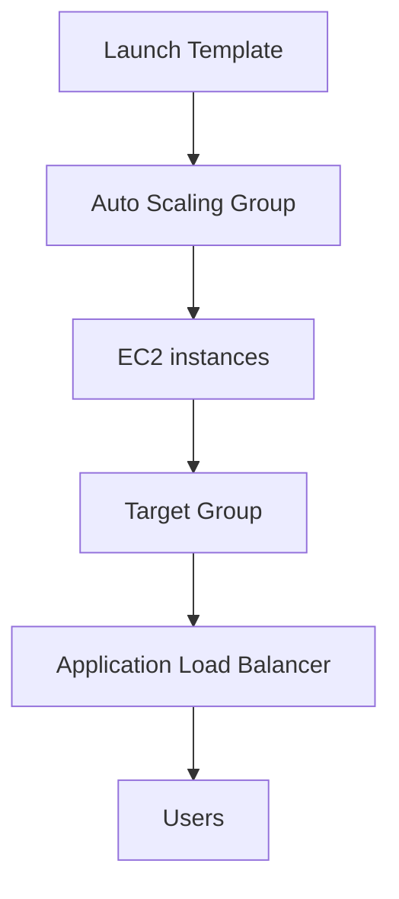

This diagram shows the configuration relationship and registration path. The request path is the reverse: users reach the ALB, the ALB selects healthy targets in the target group, and those targets are instances created and maintained by the ASG from the launch template.

- **Launch Template:** how an EC2 instance should be created.
- **Auto Scaling Group:** how many instances should exist and when they should be replaced or scaled.
- **Target Group:** which targets receive traffic and how their health is checked.
- **ALB:** how incoming HTTP/HTTPS traffic is routed to healthy targets.

### ALB and ASG lab

1. Build a launch template with a tested user-data script.
2. Select subnets in at least two AZs and attach an instance role.
3. Create a target group with an HTTP health check such as `/`.
4. Create an internet-facing ALB in public subnets and register the target group.
5. Set desired `2`, minimum `2`, and a budget-appropriate maximum.
6. Verify target health, ALB response, instance distribution, and replacement behavior.
7. Optionally generate controlled lab load with `stress -c 2`; never use unbounded load generation.

Terminate one managed instance and verify the ASG replaces it while the ALB continues serving from healthy targets. **Cleanup:** delete the ASG, launch-template versions, target group, ALB, security groups, and test instances.

**Scenario question:** An ALB reports all targets unhealthy after a deployment. What is the fastest safe investigation?

**Answer:** Test the health-check path locally on a target, confirm the process listens on the target port, inspect application logs, then check target and load-balancer security groups, NACLs, routes, and the health-check response code.

## CDN, Lambda, WAF, and Shield
[Main menu](#table-of-contents)

### CloudFront

CloudFront caches and serves content from edge locations closer to users. An edge location is not the origin; the origin is where source content or the application runs, such as S3, ALB, or API Gateway.

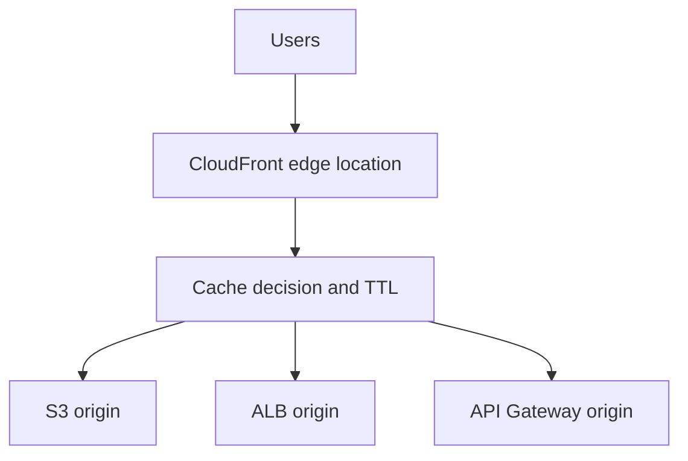

For new CloudFront + S3 designs, prefer this relationship:

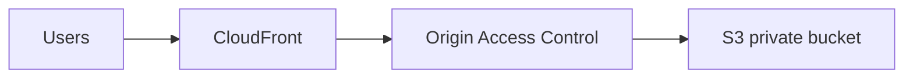

The S3 bucket does not need to be publicly readable; CloudFront uses OAC to access the private origin. Public S3 website hosting may still be demonstrated as a **LAB ONLY** concept. Origin Access Identity (OAI) is the older approach and should not be the preferred choice for new designs. Also use HTTPS viewer policies, cache policies, sensible origin timeouts, and invalidations only when needed. Geographic restrictions are a coarse delivery control, not an identity system. Origin Shield is optional and should be selected based on origin location and traffic pattern.


### Lambda

Lambda runs event-driven functions without requiring the user to manage servers. Each function is subject to service and runtime constraints such as timeout, memory, concurrency, supported runtime, and deployment/package-size limits. A function does not independently serve a web page; it needs a Function URL, API Gateway, ALB integration, event source, or another invocation path. A function that launches EC2 requires an execution role with scoped EC2 permissions and explicit network parameters.

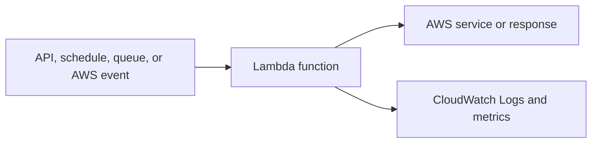

**LAB ONLY:** a scheduled Lambda that stops tagged lab instances can reduce cost, but test exclusions, time zones, permissions, and failure notifications.

### WAF and Shield

- **AWS WAF:** Layer 7 HTTP(S) inspection using Web ACLs, managed/custom rules, rate-based rules, IP sets, and count mode. It can protect supported resources such as CloudFront and ALB.
- **AWS Shield:** DDoS protection. Shield Standard is included for common protections; Shield Advanced adds capabilities and cost that must be checked against current pricing.

WAF does not replace secure application design, authentication, authorization, CSRF defenses, patching, or DDoS architecture.

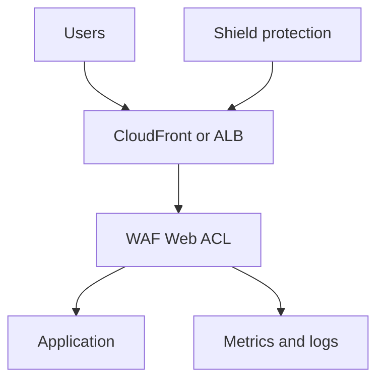

Start new WAF rules in `COUNT` where safe, inspect sampled requests and logs, then enforce carefully. **WAF lab:** attach a Web ACL to a disposable CloudFront distribution or ALB, test a narrow IP, geographic, or rate rule, verify metrics, then remove all lab resources.

**Scenario question:** A new WAF rule blocks legitimate customers. What should you do?

**Answer:** Review sampled requests and metrics, switch the rule to `COUNT` or narrow its scope, test an exception, and only then return to `BLOCK`.

## Identity and Security
[Main menu](#table-of-contents)

### IAM model

- **IAM user:** a human or legacy identity. Prefer federation or IAM Identity Center for people.
- **IAM role:** an assumable identity with temporary credentials. Prefer roles for EC2, Lambda, AWS services, and automation.
- **Trust policy:** who or what may assume a role.
- **Permissions policy:** what an identity may do and on which resources.
- **Resource policy:** permissions attached to resources such as S3 buckets or KMS keys.
- **STS:** issues temporary credentials through role assumption and federation.

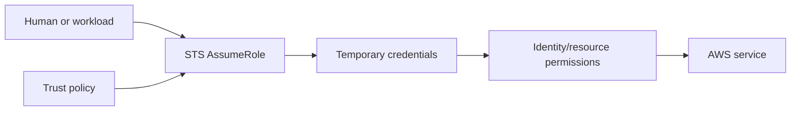

### Credential guidance

**Laptop/user:** use AWS CLI with IAM Identity Center or federation where appropriate. `aws configure` with long-lived access keys is a learning or legacy method, not the default for workloads.

**EC2:** attach an instance-profile role. **AWS services:** use service roles. **Automation:** use temporary role assumption. **GitHub Actions:** OIDC can exchange a trusted workflow identity for temporary AWS credentials; it is an optional automation example, not the focus of this knowledge base.

```bash
aws sts get-caller-identity
```

This confirms which principal the CLI is using. If a lab must use `aws configure`, use placeholders and delete or rotate credentials afterward. Never place keys in user data, source control, AMIs, shell history, or scripts.

### Least privilege and classification

Start with exact actions, resources, and conditions. A policy using `*` or `FullAccess` is:

**LAB ONLY - NOT A PRODUCTION RECOMMENDATION.**

| Classification | Examples | Handling |
|---|---|---|
| PUBLIC | Public documentation, public assets | Share intentionally |
| INTERNAL | Architecture diagrams, internal configuration | Organization access only |
| CONFIDENTIAL | Non-public application configuration | Limit and encrypt |
| RESTRICTED | Passwords, keys, tokens, private keys | Secrets manager, rotation, audit |

Use Secrets Manager for managed secret storage and rotation. Parameter Store is useful for configuration and some encrypted values. Use KMS for key management and encryption controls. Encryption at rest protects stored data; TLS protects data in transit.

### Security verification

```bash
aws iam simulate-principal-policy --policy-source-arn <ROLE_ARN> --action-names s3:ListBucket --resource-arns <BUCKET_ARN>
```

When access is denied, check identity policy, resource policy, trust policy, SCPs, permission boundaries, session policies, KMS key policy, Region, and explicit denies.

**Scenario question:** An EC2 application must read one S3 bucket without storing credentials. What should you implement?

**Answer:** Attach an instance-profile role with an EC2 trust policy and a least-privilege permissions policy scoped to the bucket and required object actions.

### Secrets Manager versus Parameter Store

| Service | Good fit | Decision factors |
|---|---|---|
| Secrets Manager | Application secrets, database credentials, rotation, and secret lifecycle | Rotation integrations, retrieval pattern, lifecycle, and cost |
| Parameter Store | Application configuration, parameters, and appropriate encrypted parameters | Simpler configuration storage, hierarchy, retrieval needs, and cost |

Do not reduce the decision to “passwords versus everything else.” Consider rotation, integrations, access patterns, lifecycle, compliance, and cost. Never put secret values directly in this README, templates, user data, or source control.

## Monitoring and Audit
[Main menu](#table-of-contents)

### CloudWatch

- **Metrics:** numeric time series such as CPU, latency, errors, or queue depth.
- **Logs:** application, OS, and service event records.
- **Alarms:** metric evaluations that notify or trigger actions.
- **Dashboards:** operator views and trends.
- **EventBridge:** event routing and scheduled automation.
- **Tracing:** distributed request context through suitable tracing tooling.

Linux `top`, `free`, `df`, and `systemctl` are host-level checks, not CloudWatch by themselves. Install and configure the CloudWatch agent when OS metrics or logs are needed.

### CloudWatch, CloudTrail, and EventBridge

| Service | Main question | Core capabilities |
|---|---|---|
| CloudWatch | Is my system healthy? | Metrics, logs, alarms, dashboards |
| CloudTrail | Who did what in AWS? | API activity, identity, source, timestamp, API event |
| EventBridge | What should happen when an event occurs? | Event routing, automation, schedules, AWS/application events |

These services complement one another. CloudWatch measures operations, CloudTrail records AWS API activity, and EventBridge routes events to actions; none replaces the others.

### CloudTrail

CloudTrail answers who called which AWS API, when, from where, and with what result. Management events cover control-plane operations. Data events, such as S3 object access, provide object-level detail but can create more volume and cost.

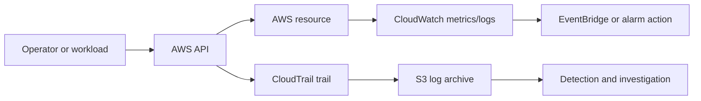

### CloudTrail lab

1. Create a restricted log destination with retention.
2. Create a trail with a unique name such as `buckets-events`.
3. Enable management events and narrowly scoped S3 data events where justified.
4. Enable log validation and KMS encryption in production designs.
5. Perform a test object operation.
6. Find the event by name, resource, principal, and time.

```bash
aws cloudtrail lookup-events --lookup-attributes AttributeKey=EventName,AttributeValue=PutObject
```

Verify principal, timestamp, Region, resource, and outcome. Delivery can be delayed; CloudTrail is not an instant application-health signal.

**Scenario question:** An unknown principal changed a security group. Which service and evidence do you use first?

**Answer:** Use CloudTrail to identify the API call, principal, source IP, Region, timestamp, and result. Then contain the identity and preserve evidence.

## High Availability, Backup, and DR
[Main menu](#table-of-contents)

**High Availability** keeps a workload serving during expected component or AZ failures. **Disaster Recovery** restores it after a larger event such as regional disruption, corruption, or account compromise.

- **Single AZ:** simple and inexpensive; one AZ failure can stop the workload.
- **Multi-AZ:** common production baseline for compute and dependencies.
- **Multi-Region:** regional recovery and data residency option with more cost and complexity.

**RPO** is the maximum acceptable data loss. **RTO** is the maximum acceptable recovery time.

For example, an **RPO of 15 minutes** means the recovery design should lose no more than about 15 minutes of accepted data. An **RTO of 1 hour** means the service should be restored and usable within one hour. Meeting those targets requires suitable replication or backup frequency, restore automation, dependencies, permissions, DNS, and a tested runbook; a backup existing somewhere does not automatically satisfy either target.

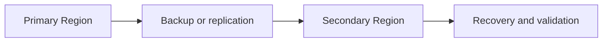

| Mechanism | Best fit | Important limit |
|---|---|---|
| Snapshot | Point-in-time EBS volume recovery | Restore still takes time |
| AMI | Repeatable EC2 provisioning | Not a complete application DR plan |
| AWS Backup | Central policy, retention, vaults, copies | Restore procedures must be tested |
| Replication | Lower RPO or regional copy | Can replicate bad or deleted data |

If an instance fails, an ASG can replace it when configured. If an AZ fails, multi-AZ load balancing and replicas can continue serving. If a Region fails, only a prepared regional strategy helps. Versioning, immutable backups, retention controls, and point-in-time recovery matter when data is corrupted.

### AWS Backup lab

1. Define a disposable backup plan and retention.
2. Select a test EC2 resource or tag-based selection.
3. Use a dedicated vault and least-privilege role.
4. Start an on-demand backup and wait for completion.
5. Restore into an approved VPC, subnet, security group, and role.
6. Verify the restored instance, storage, application, tags, and access.

Backup is not instant HA. Test restore time and application consistency against the RTO. Backups, snapshots, replicas, secondary resources, NAT gateways, and retained logs continue to cost money.

**Scenario question:** A regional outage occurs and the team has backups in another Region. Can it meet a one-hour RTO automatically?

**Answer:** Not necessarily. Test restore duration, quotas, networking, DNS, IAM, KMS, secrets, application artifacts, data consistency, and the recovery runbook.

## Infrastructure as Code
[Main menu](#table-of-contents)

CloudFormation describes AWS resources as code, then creates and updates a stack.

```mermaid
flowchart TD
    Template[Template] --> Stack[CloudFormation stack]
    Stack --> Resources[AWS resources]
    Stack --> Outputs[Outputs]
    Change[Change set] --> Stack
    Drift[Drift detection] --> Stack
```

### Core concepts

- **Resource:** an AWS object managed by the stack.
- **Parameter:** deployment input such as instance type or VPC ID.
- **Mapping:** lookup table for structured values.
- **Condition:** optional resource/property logic.
- **Output:** displayed or exported result.
- **Intrinsic function:** reference, substitution, join, or conditional expression.
- **Dependency:** explicit or inferred creation order.
- **Change set:** preview before an update.
- **Drift:** difference between template and actual state.
- **Rollback:** failure handling that depends on operation type, deletion policies, and failure state; it does not always erase every side effect.

### Parameterized example

```yaml
AWSTemplateFormatVersion: '2010-09-09'
Description: Minimal parameterized EC2 example for a disposable lab

Parameters:
  InstanceType:
    Type: String
    Default: t3.micro
  AmiId:
    Type: AWS::EC2::Image::Id
  SubnetId:
    Type: AWS::EC2::Subnet::Id
  SecurityGroupId:
    Type: AWS::EC2::SecurityGroup::Id

Resources:
  WebInstance:
    Type: AWS::EC2::Instance
    Properties:
      ImageId: !Ref AmiId
      InstanceType: !Ref InstanceType
      SubnetId: !Ref SubnetId
      SecurityGroupIds:
        - !Ref SecurityGroupId
      Tags:
        - Key: Name
          Value: !Sub '${AWS::StackName}-web'

Outputs:
  InstanceId:
    Value: !Ref WebInstance
```

**LAB ONLY:** this omits production launch-template, private-subnet, patching, monitoring, and recovery design. Do not hardcode AMIs, account IDs, key names, IPs, instance IDs, bucket names, or secrets.

### CloudFormation learning progression

This intentionally minimal example is **LAB / LEARNING** material. Its purpose is to make the relationship between a template, parameters, resources, outputs, and intrinsic functions easy to understand before introducing more moving parts.

1. **Stage 1:** Understand the template, parameter, resource, output, and intrinsic-function concepts.
2. **Stage 2:** Add an IAM role, launch template, user data, encrypted EBS, monitoring, and consistent tags.
3. **Stage 3:** Move toward multiple AZs, private networking, an ALB, Auto Scaling, production-style recovery, change sets, and drift detection.

The minimal example is not a production architecture; it is a small learning step that can be validated and deleted safely.

### CloudFormation workflow

```bash
aws cloudformation validate-template --template-body file://template.yaml
aws cloudformation create-stack --stack-name <STACK_NAME> --template-body file://template.yaml --parameters ParameterKey=AmiId,ParameterValue=<AMI_ID> ParameterKey=SubnetId,ParameterValue=<SUBNET_ID> ParameterKey=SecurityGroupId,ParameterValue=<SECURITY_GROUP_ID>
aws cloudformation describe-stack-events --stack-name <STACK_NAME>
aws cloudformation create-change-set --stack-name <STACK_NAME> --change-set-name <CHANGE_SET_NAME> --template-body file://template.yaml
```

Inspect stack status, resource status, outputs, and events. Review a change set before an update. Run drift detection when manual changes may have occurred. Use roles, dynamic references or Secrets Manager, stack policies, termination protection, and deletion policies thoughtfully.

**Scenario question:** A CloudFormation update proposes replacing a database or deleting a resource. What should you do before execution?

**Answer:** Review the change set, replacement behavior, deletion policy, backups, dependencies, downtime, and rollback path. Stop and revise the template if the impact is not intentional and recoverable.

### Terraform fundamentals

Terraform is a declarative Infrastructure as Code tool that provisions AWS resources from configuration files. It is an additional option, not a replacement that is universally better than CloudFormation.

```mermaid
flowchart LR
        Config[Terraform configuration] --> Plan[terraform plan]
        Plan --> Apply[terraform apply]
        Apply --> Provider[AWS provider]
        Provider --> Resources[AWS resources]
        Apply --> State[Terraform state]
```

Core concepts:

- **Provider:** plugin that translates configuration into AWS API operations.
- **Resource:** an object Terraform manages.
- **Variable:** reusable input.
- **Output:** value exposed after an apply.
- **Module:** reusable group of configuration.
- **State:** record of Terraform's view of managed resources; protect and manage it carefully.
- **Plan:** preview of proposed changes.
- **Apply:** execute approved changes.
- **Destroy:** remove managed resources; destructive and requiring explicit review.

```hcl
terraform {
    required_providers {
        aws = {
            source = "hashicorp/aws"
        }
    }
}

variable "region" {
    type    = string
    default = "<AWS_REGION>"
}

provider "aws" {
    region = var.region
}

output "selected_region" {
    value = var.region
}
```

Use CloudFormation when AWS-native infrastructure, deep AWS integration, or CloudFormation-specific capabilities are the priority. Consider Terraform for multi-provider or multi-cloud environments, teams standardized on Terraform, or a broader provider ecosystem. In either tool, review plans, protect state, avoid plaintext secrets, and use separate environments and state boundaries.

## Practical Labs
[Main menu](#table-of-contents)

### Lab checklist

Every lab should include an objective, architecture, prerequisites, steps, verification, safe failure simulation, troubleshooting, cleanup, and a short learning summary.

Use a disposable account or sandbox with budgets and tags such as `Environment=lab`. Avoid public access and broad policies except for a deliberately isolated exercise.

### Preserved lab index

Before starting a lab, complete the relevant setup in [Prerequisites and Setup](#prerequisites-and-setup). Most AWS labs require AWS CLI/authentication, a selected Region, IAM permissions, billing awareness, and cleanup tags. EC2 labs may additionally require Git and SSH or Session Manager; RDS labs require a MySQL client; EFS labs require NFS utilities; load tests require `stress` on a disposable instance.

- **EC2 web server:** launch EC2, install Nginx, serve a test site, inspect logs, and troubleshoot a port change.
- **S3 storage:** create buckets, upload objects, configure SRR/CRR, presigned URLs, lifecycle rules, transfer acceleration, and batch operations.
- **EFS:** mount a regional file system from two EC2 instances in different AZs and verify shared files.
- **RDS + EC2:** connect a controlled EC2 client to a private MySQL RDS instance using Secrets Manager.
- **ALB + ASG:** serve an application across AZs, verify target health, scaling, and replacement.
- **CloudTrail:** audit management and selected S3 data events.
- **CloudWatch:** build a dashboard, generate controlled lab CPU load, and create an alarm.
- **AMI migration:** create an AMI, copy it to another Region, launch from it, and review Recycle Bin recovery.
- **EBS migration:** snapshot a volume, copy the snapshot, create a volume in another Region, and attach it to a test instance.
- **VPC public/private:** create public and private subnets, route tables, IGW, NAT, and private application access.
- **VPC peering:** peer two non-overlapping VPCs, update routes and security controls, and test connectivity.
- **CloudFront:** use an ALB or S3 origin, verify cache behavior and HTTPS, and test geographic restrictions.
- **WAF:** attach a Web ACL, begin with count mode, verify sampled requests, then clean up.
- **CloudFormation:** validate a parameterized template, create a stack, preview a change set, update, and inspect drift.
- **AWS Backup:** create and restore a test backup and verify the recovered resource.

### Cleanup checklist

Delete or review EC2 instances, EBS volumes, Elastic IPs, NAT gateways, load balancers, target groups, RDS instances, test S3 buckets and versions, EFS file systems, CloudWatch alarms, CloudTrail trails, WAF distributions, and CloudFormation stacks. Some resources continue billing after the primary resource is deleted.

## CLI and Command Reference
[Main menu](#table-of-contents)

### AWS CLI setup

**Recommended modern approach:** use IAM Identity Center or federation on a laptop, IAM roles on EC2 and AWS services, and temporary role assumption for automation. GitHub Actions can use OIDC as one optional automation path.

**LAB / LEGACY LEARNING:** `aws configure` with a dedicated, restricted profile can explain CLI configuration, but long-lived access keys should not be the default workload credential method.

```bash
aws configure
aws sts get-caller-identity
cat ~/.aws/config
cat ~/.aws/credentials
```

Never paste real values into notes. Use `<ACCESS_KEY_ID>` and `<SECRET_ACCESS_KEY>` placeholders, rotate exposed keys, and prefer profiles or federation. On Windows, install the AWS CLI using the official AWS installer; on Linux, use the official AWS CLI package or installer rather than copying credentials into a server image.

### S3 commands

```bash
aws s3 ls
aws s3 ls s3://<BUCKET_NAME>
aws s3 mb s3://<BUCKET_NAME>
aws s3 cp ./file.txt s3://<BUCKET_NAME>/file.txt
aws s3 cp s3://<BUCKET_NAME>/file.txt .
aws s3 cp ./folder s3://<BUCKET_NAME>/folder --recursive
aws s3 sync s3://<SOURCE_BUCKET> s3://<DESTINATION_BUCKET>
aws s3 rb s3://<BUCKET_NAME> --force
```

These commands require the matching S3 permissions. `rb --force` is destructive for a test bucket; versioned buckets may still require version and delete-marker cleanup.

### EC2 commands

```bash
aws ec2 describe-instances
aws ec2 describe-instances --instance-ids <INSTANCE_ID>
aws ec2 stop-instances --instance-ids <INSTANCE_ID>
aws ec2 start-instances --instance-ids <INSTANCE_ID>
aws ec2 terminate-instances --instance-ids <INSTANCE_ID>
```

Verify the Region and profile before changing instance state. Termination is destructive and does not replace a backup or recovery plan.

### IAM commands

```bash
aws iam list-users
aws iam list-groups
aws iam list-roles
aws iam create-group --group-name <GROUP_NAME>
aws iam create-user --user-name <USER_NAME>
aws iam create-role --role-name <ROLE_NAME> --assume-role-policy-document file://trust-policy.json
```

Use these for controlled administration, not as a substitute for least privilege or Infrastructure as Code. An IAM group cannot be nested. Permission boundaries cap the maximum permissions an identity can receive; they do not grant permissions by themselves.

### Linux essentials

```bash
sudo -i
mkdir <DIRECTORY>
cd <DIRECTORY>
ls -la
touch <FILE>
cat <FILE>
cp <SOURCE> <DESTINATION>
mv <SOURCE> <DESTINATION>
rm <FILE>
vim <FILE>
```

In `vim`, press `i` to insert, `Esc` then `:wq` to save and exit. Treat `rm` as destructive and avoid broad commands such as `rm *` outside a disposable directory. Use `systemctl enable` for boot startup; do not confuse it with stopping a service.

## Linux and AWS Troubleshooting
[Main menu](#table-of-contents)

### Slow application playbook

```bash
top
htop
free -h
cat /proc/meminfo
lscpu
cat /proc/cpuinfo
df -h
lsblk
ps aux
uptime
lsof
vmstat 5
ss -lntp
curl -I http://localhost
dig <DOMAIN_NAME>
ip addr
```

- `top`/`htop`: CPU, load, processes, and memory pressure.
- `free -h` and `/proc/meminfo`: available memory and swap indicators.
- `lscpu` and `/proc/cpuinfo`: CPU details.
- `df -h`: filesystem capacity; `lsblk` shows devices and mounts.
- `ps aux`: process state and command lines.
- `uptime`: time since boot and load averages.
- `lsof`: open files and sockets.
- `vmstat 5`: CPU, memory, and I/O samples every five seconds; stop with `Ctrl+C`.
- `ss`: listening sockets and established connections.
- `curl`: application response from the host.
- `dig`: DNS answers and resolver behavior.
- `ip addr`: addresses and interfaces.

### HTTP failure playbook

1. Confirm the process is listening with `ss -lntp`.
2. Test locally with `curl -I http://localhost`.
3. Validate Nginx with `sudo nginx -t`.
4. Check `systemctl status nginx`, `journalctl -u nginx`, and Nginx error logs.
5. Confirm security-group and NACL rules.
6. Confirm subnet route, public/private address, DNS, and target health.
7. Check that the proxy forwards to the port where the application listens.

### Source scenarios, made safe

To inspect client IPs:

```bash
sudo tail -f /var/log/nginx/access.log
```

The original notes use `deny all;`. That blocks every matching client, not one IP. In a disposable lab, use a narrow CIDR, back up the file, validate, and reload:

```bash
sudo cp /etc/nginx/nginx.conf /etc/nginx/nginx.conf.bak
sudo nginx -t
sudo systemctl reload nginx
```

To change Nginx from port 80 to 8080, update the correct `listen` directive, validate, update AWS security-group rules and target configuration, then reload. Changing only Nginx commonly causes a false diagnosis.

For AWS failures, check identity and Region first, then resource state, DNS and network path, IAM/resource/KMS policies, application and OS logs, CloudWatch, CloudTrail, recent changes, and quotas.

## Architecture Decision Tables
[Main menu](#table-of-contents)

| Decision | Choose this when | Main caution |
|---|---|---|
| EC2 vs Lambda | Need OS control/long-running service vs event-driven execution | Lambda runtime, concurrency, and timeout constraints |
| EBS vs EFS vs S3 | Need block vs shared file vs object access | Access model determines the correct service |
| ALB vs NLB vs Gateway Load Balancer | HTTP-aware routing vs TCP/UDP/TLS vs inline appliances | Choose by protocol and target behavior |
| Multi-AZ vs Multi-Region | AZ fault tolerance vs regional recovery | Multi-Region adds replication, DNS, and deployment complexity |
| IAM user vs IAM role | Legacy/person identity vs temporary assumed identity | Avoid long-lived access keys |
| CloudWatch vs CloudTrail | Operations telemetry vs API audit | Neither replaces the other |
| VPC peering vs Transit Gateway | Small direct connection vs many VPCs/central routing | Peering is non-transitive; TGW has cost and route design |
| NAT Gateway vs VPC endpoint | Public outbound dependency vs private AWS-service path | NAT hourly/data charges; endpoints are service-specific |
| RDS Multi-AZ vs read replica | Failover/availability vs read scaling | Multi-AZ is not a read-scaling feature |
| Snapshot vs AMI vs AWS Backup | Volume restore vs EC2 image provisioning vs policy backup | Test restore and retention behavior |
| CloudFormation vs Terraform | AWS-native stack management vs multi-provider IaC | Both require reviewed plans, protected state, and secret handling |
| Secrets Manager vs Parameter Store | Rotated secrets vs configuration/parameters | Choose by rotation, lifecycle, integrations, and cost |
| CloudWatch vs CloudTrail vs EventBridge | Health vs audit vs event reaction | These services complement rather than replace one another |
| CloudFront OAC vs public S3 access | Private origin access vs disposable public website demo | OAC is preferred for new production patterns |

## Interview and Scenario Questions
[Main menu](#table-of-contents)

### EC2 and storage

**Question:** What are the main choices when creating EC2?

**Answer:** AMI, instance type, VPC/subnet, routes, security group, IAM role, storage, key/access method, user data, and tags.

**Question:** What are EBS, EFS, and S3?

**Answer:** EBS is block storage for a host, EFS is shared file storage, and S3 is object storage through APIs.

**Question:** What is an AMI used for?

**Answer:** Repeatable instance provisioning, including an OS and software baseline. It is not a generic replacement for every backup method.

### S3

**Question:** How do you reduce S3 storage cost?

**Answer:** Use lifecycle transitions and expiration based on real access and retention requirements, then verify the economics of each class.

**Question:** How do you share an object temporarily?

**Answer:** Use a short-lived presigned URL with an appropriately restricted signer. Treat the URL as a bearer credential while valid.

**Question:** Does replication copy all old objects automatically?

**Answer:** Do not assume it does. Validate the current behavior and use Batch Operations or an explicit migration for existing objects when required.

### Networking

**Question:** What makes a subnet public?

**Answer:** Its route table has a route to an Internet Gateway. A resource still needs the right address and security controls.

**Question:** Security group versus NACL?

**Answer:** Security groups are stateful interface-level controls; NACLs are stateless subnet-level controls with ordered allow/deny rules.

**Question:** NAT Gateway versus VPC endpoint?

**Answer:** NAT provides outbound internet access for private IPv4 resources; an endpoint provides private access to supported AWS services.

### Load balancing and scaling

**Question:** Why can an ALB show unhealthy targets?

**Answer:** Wrong port or path, application failure, security-group rules, NACL return traffic, route issues, or an invalid health-check response.

**Question:** What happens when an ASG instance is terminated?

**Answer:** The ASG normally launches a replacement to restore desired capacity, provided quotas, launch configuration, and dependencies work.

### IAM and security

**Question:** Why are roles preferred over access keys on EC2?

**Answer:** Roles provide temporary credentials through an instance profile and avoid distributing long-lived secrets.

**Question:** Trust policy versus permissions policy?

**Answer:** Trust controls who may assume a role; permissions control what the resulting identity may do.

### Monitoring and audit

**Question:** CloudWatch versus CloudTrail?

**Answer:** CloudWatch is operational telemetry; CloudTrail is AWS API auditing.

**Question:** What should be checked when an AWS request fails?

**Answer:** Caller identity, Region, DNS, route path, security group/NACL, target health, IAM/resource/KMS policies, application logs, metrics, and CloudTrail events.

### Reliability and database

**Question:** Is RDS Multi-AZ the same as a read replica?

**Answer:** No. Multi-AZ primarily supports availability and failover; a read replica asynchronously supports read scaling and selected recovery designs.

**Question:** Is a backup automatically DR?

**Answer:** No. DR requires tested recovery, suitable copies, dependencies, access, and an RTO the restore path can meet.

### CloudFormation

**Question:** What is a change set?

**Answer:** A preview of resource changes for a stack update before execution.

**Question:** What is drift?

**Answer:** A difference between the declared template and actual resource configuration, often caused by manual changes.

### Additional interview questions

**Question:** Why use OAC with CloudFront and S3?

**Answer:** OAC allows CloudFront to read a private S3 origin without making the bucket publicly readable. It is the preferred modern pattern for new CloudFront + S3 designs; OAI is the older approach.

**Question:** Why is a public subnet not automatically public to users?

**Answer:** The subnet route is only one condition. The resource also needs an appropriate public address, security-group and NACL rules, and a service listening on the requested port.

**Question:** Terraform or CloudFormation?

**Answer:** Choose based on team standards and scope. CloudFormation is AWS-native; Terraform is useful for multi-provider or multi-cloud environments. Neither is universally better.

**Question:** What is the difference between Secrets Manager and Parameter Store?

**Answer:** Both can store configuration-related values. Secrets Manager is often a better fit for managed secrets and rotation; Parameter Store often fits hierarchical application configuration and suitable encrypted parameters. Requirements and cost decide.

**Question:** What is the difference between CloudWatch, CloudTrail, and EventBridge?

**Answer:** CloudWatch observes health, CloudTrail audits AWS API activity, and EventBridge routes events to automation.

### Scenario: web server unreachable

**Answer:** Check the service locally, listener port, OS logs, instance state, public/private addressing, subnet route, IGW/NAT path, security group, NACL, DNS, and load-balancer health checks in that order.

## Production Checklist
[Main menu](#table-of-contents)

- [ ] Use IAM Identity Center, federation, roles, and temporary credentials where possible.
- [ ] Enable MFA and protect the root user; do not use root for routine work.
- [ ] Keep databases and internal services private.
- [ ] Apply least privilege to identity and resource policies.
- [ ] Encrypt data at rest and in transit; protect KMS permissions.
- [ ] Use multiple AZs for production availability where appropriate.
- [ ] Define RPO and RTO and test restore/failover.
- [ ] Use CloudWatch metrics/logs/alarms and CloudTrail auditing.
- [ ] Use change sets, drift detection, and reviewable Infrastructure as Code.
- [ ] Tag resources, set budgets, and remove lab resources promptly.
- [ ] Review NAT, data-transfer, load-balancer, RDS, storage, and log-retention costs.
- [ ] Keep console instructions as orientation only; prefer CLI, API, and IaC as the source of truth.

## Console Usage and Durable Verification
[Main menu](#table-of-contents)

Console labels and locations may change. Use the Console to understand a service or inspect a resource, but prefer CLI, API, and IaC for repeatable work. For each console-oriented action, identify the conceptual choices first, use the equivalent CLI/API/IaC where practical, and verify the resulting resource state, network path, identity, logs, metrics, and costs.

## Source Notes and Corrections
[Main menu](#table-of-contents)

The original classroom source is preserved as [AWS Notes.txt](AWS%20Notes.txt). It contains useful practical material, but also stale IDs, endpoints, public IPs, sample passwords, and console-dependent instructions. Those values were not copied into this README.

The most important corrections are:

- S3 replication is asynchronous and is not a generic cross-account sharing or latency solution.
- S3 durability is `99.999999999%`, not availability; free-tier amounts and bucket quotas are date- and account-dependent.
- EBS volumes are zonal; snapshots are regional by default.
- AMIs package launchable machine configuration; snapshots back up block volumes.
- EFS can be mounted by Auto Scaling instances when mount automation is configured.
- ALB routing features and stickiness are not all load-balancing algorithms.
- ASGs primarily perform horizontal replacement and scaling; vertical scaling is a separate strategy.
- RDS read replicas do not automatically become the primary after source deletion.
- CloudFormation rollback depends on operation type and deletion policies.
- CloudFront edge locations serve cached content; they are not the application origin.
- Lambda needs an invocation integration to serve a web response.
- WAF does not replace application security or all DDoS protection.
- Nginx `deny all;` blocks all matching clients, and changing a port also requires matching AWS network rules.
