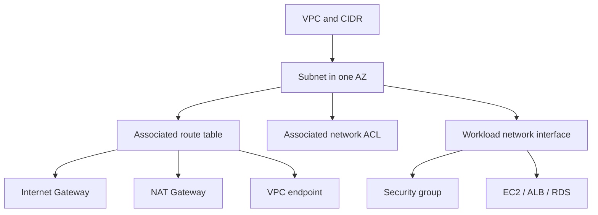
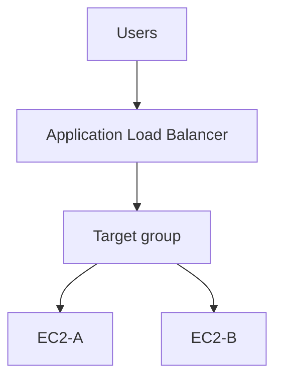
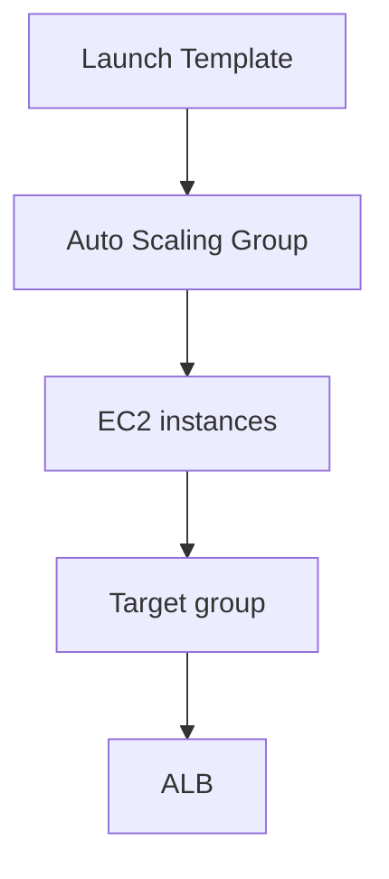
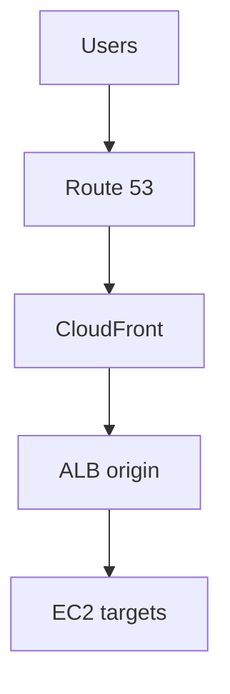
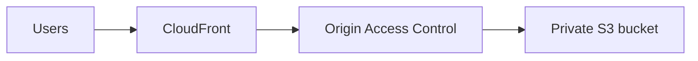
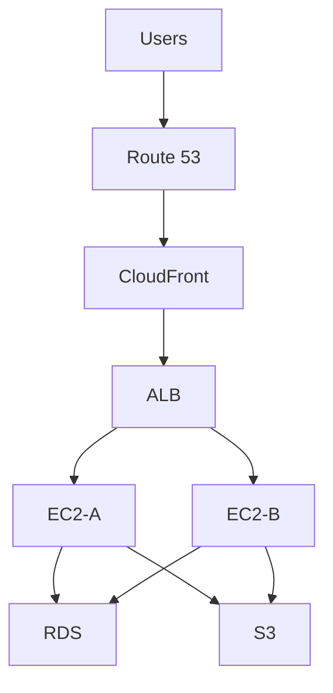

# AWS From Zero: Learn by Building

A practical AWS and DevOps course for beginners and intermediate learners. You will build one small web application, change it deliberately, observe failures, and then connect those observations to AWS architecture, security, operations, and interview reasoning.

> This is a personal learning guide, not official AWS documentation. Console labels, pricing, quotas, Regions, runtime versions, and service behavior change. Verify current AWS documentation before production use.

## Table of Contents

- [How to Use This Guide](#how-to-use-this-guide)
- [The Running Project](#the-running-project)
- [Stage 1 - AWS Basics](#stage-1---aws-basics)
- [Stage 2 - My First EC2 Web Server](#stage-2---my-first-ec2-web-server)
- [Stage 3 - Storage and Networking](#stage-3---storage-and-networking)
- [Stage 4 - IAM and Secure Access](#stage-4---iam-and-secure-access)
- [Stage 5 - RDS Database](#stage-5---rds-database)
- [Stage 6 - ALB and Multiple EC2 Instances](#stage-6---alb-and-multiple-ec2-instances)
- [Stage 7 - Auto Scaling and Failure Recovery](#stage-7---auto-scaling-and-failure-recovery)
- [Stage 8 - CloudFront and Route 53](#stage-8---cloudfront-and-route-53)
- [Stage 9 - Monitoring and Audit](#stage-9---monitoring-and-audit)
- [Stage 10 - CloudFormation and Terraform](#stage-10---cloudformation-and-terraform)
- [Stage 11 - Cross-Service Scenarios](#stage-11---cross-service-scenarios)
- [Production Thinking](#production-thinking)
- [Troubleshooting Reference](#troubleshooting-reference)
- [Lab Index and Cleanup](#lab-index-and-cleanup)
- [CLI Quick Reference](#cli-quick-reference)
- [Interview Preparation](#interview-preparation)

## How to Use This Guide

[Main menu](#table-of-contents)

Do not read this as a list of definitions. Open AWS, use a disposable account or sandbox, run the commands, and pause whenever a section says **Predict**.

Every lesson follows this rhythm:

```text
Problem
  ↓
Short explanation
  ↓
Build
  ↓
Verify
  ↓
Break one thing safely
  ↓
Observe
  ↓
Explain why
  ↓
Scenario and checkpoint
```

### Safety labels

- **LAB / LEARNING:** use only with disposable resources and a budget alert.
- **PRODUCTION RECOMMENDATION:** a baseline that still needs workload-specific review.
- **WARNING:** a command or change can cause cost, access, or data loss.
- **EXPERIMENT:** change one disposable control, observe the result, and restore it.

Never put real passwords, access keys, secret keys, private keys, tokens, account IDs, public IPs, endpoints, or resource IDs in this document. Use `<AWS_REGION>`, `<AMI_ID>`, `<INSTANCE_ID>`, `<VPC_ID>`, `<SUBNET_ID>`, `<SECURITY_GROUP_ID>`, `<RDS_ENDPOINT>`, and `<BUCKET_NAME>`.

## The Running Project

[Main menu](#table-of-contents)

We will gradually evolve this:

```text
Laptop
  ↓ Internet
One EC2 instance
  ↓
Nginx and a simple page
```

into this:

```text
Users
  ↓
Route 53
  ↓
CloudFront
  ↓
Application Load Balancer
  ↓
Auto Scaling group
  ↓
EC2 instances in multiple AZs
  ↓
RDS database and S3 objects
```

Do not study the final architecture first. Earn each component by encountering the problem it solves.

## Stage 1 - AWS Basics

[Main menu](#table-of-contents)

### What are we trying to do?

We have a website on a laptop. We want it to keep running when the laptop is off and be reachable from the internet.

### Understand just enough

Cloud computing means renting infrastructure and managed services on demand. AWS provides compute, storage, networking, databases, security, and monitoring through the Console, CLI, APIs, SDKs, and Infrastructure as Code.

Before creating anything, AWS asks where to create it.

- A **Region** is a geographic AWS location.
- An **Availability Zone** is an isolated location inside a Region.
- A **zonal resource** is tied to one AZ, such as an EBS volume.
- A **regional resource** is designed within a Region, such as a VPC.

### Let's choose a Region

Use the Console Region selector, then make the choice explicit in the CLI:

```bash
aws configure set region <AWS_REGION> --profile <PROFILE_NAME>
aws ec2 describe-availability-zones --profile <PROFILE_NAME> --query 'AvailabilityZones[].ZoneName'
```

**Expected result:** the command lists AZs for the selected Region.

**Predict:** what changes if you run the same command in another Region? AMI IDs, quotas, available instance types, and service availability can differ.

### What just happened?

The Region is part of the context for most AWS operations. A command can succeed while inspecting the wrong Region if the profile or environment is wrong.

### Cost awareness

Create a billing alert before labs. EC2, EBS, public IPv4 addresses, NAT Gateways, RDS, load balancers, EFS, CloudFront, data transfer, and log retention can cost money. Verify current pricing rather than memorizing temporary free-tier limits.

### Checkpoint

1. Why use cloud infrastructure?
2. What is the difference between a Region and an AZ?
3. Why does Region selection matter?
4. Why is a single-AZ design not regional disaster recovery?

**Answers:** Cloud provides on-demand infrastructure; a Region contains isolated AZs; resources, latency, data residency, quotas, and price depend on Region; a regional failure can affect every resource in one Region.

### Scenario interview questions

**Question:** Your command shows no EC2 instances, but you know one exists. What do you check?

**How to think:** Check profile, account identity, Region, filters, and permission before assuming the instance disappeared.

**Answer:** Run `aws sts get-caller-identity`, verify the profile and Region, then run `describe-instances` without an overly restrictive filter.

**Common wrong answer:** Immediately create another instance.

## Stage 2 - My First EC2 Web Server

[Main menu](#table-of-contents)

### What are we trying to do?

Launch one virtual server, connect to Linux, install Nginx, create a page, and open it from a browser.

### Understand just enough

**EC2 = a computer you rent from AWS.** Technically, an EC2 instance is a virtualized compute resource with an AMI, instance type, network interface, storage, identity, and security controls.

- **AMI:** starting operating-system and software image.
- **Instance type:** CPU, memory, network, and price profile.
- **Public IPv4:** address reachable through a public path.
- **Private IPv4:** internal VPC address.
- **Port:** identifies a service; HTTP commonly uses 80 and HTTPS 443.
- **Security Group:** stateful network control attached to the instance network interface.
- **EBS:** block storage used for the root and data volumes.

### Build it

1. Create or select a VPC and subnet appropriate for a lab.
2. Choose a trusted Linux AMI and small instance type.
3. Enable a public IP only for this learning step.
4. Create a security group allowing HTTP 80 from your test source. Allow SSH 22 only from a controlled IP, or use Systems Manager.
5. Attach an IAM instance role when the instance must call AWS services.
6. Select encrypted EBS storage and tag the instance `Environment=lab`.

**Console orientation:** labels and locations change. Make the conceptual choices above, then verify subnet, route table, security group, role, storage, and instance status.

### Install Nginx

On an Ubuntu/Debian lab instance:

```bash
sudo apt update
sudo apt install -y nginx
sudo systemctl enable --now nginx
sudo systemctl status nginx
```

Create a visibly identifiable page:

```bash
printf 'Hello from the first EC2 web server\n' | sudo tee /var/www/html/index.html
curl -I http://localhost
curl http://localhost
```

**Expected result:** Nginx is active and `curl` returns the page text.

From your computer:

```bash
curl http://<PUBLIC_IP>
```

Open `http://<PUBLIC_IP>` in a browser.

### What just happened?

```text
Browser
  ↓
Public address
  ↓
Subnet route
  ↓
Internet Gateway
  ↓
Security Group allows TCP 80
  ↓
EC2 network interface
  ↓
Nginx listens on port 80
  ↓
HTML response
```

The EC2 `Running` state only says the virtual machine is running. It does not prove that Nginx, routing, DNS, or security rules are correct.

### Experiment: stop the application

**Predict:** what will happen?

```bash
sudo systemctl stop nginx
curl -I http://localhost
sudo systemctl start nginx
```

The instance stays running, but the local request fails because no process is listening. This separates infrastructure health from application health.

### Experiment: remove HTTP access

In a disposable lab, remove the HTTP 80 ingress rule from the security group and refresh the browser.

**Expected result:** the instance and Nginx remain running, but the network path is blocked. Restore the rule afterward.

### Common mistakes

| Symptom | Likely cause | Check |
|---|---|---|
| Timeout | Route, public address, SG, or NACL | `ip route`, subnet route, SG, NACL |
| Connection refused | Service is not listening | `systemctl status nginx`, `ss -lntp` |
| SSH fails | Wrong username, key permissions, or port 22 rule | AMI username, `chmod 400 <KEY_FILE>`, SG |
| Wrong page | Wrong file or server | `pwd`, `ls -l /var/www/html`, Nginx config |

### Cleanup

**WARNING:** `terminate-instances` is destructive. Verify Region, profile, and instance ID first.

```bash
aws sts get-caller-identity
aws ec2 terminate-instances --instance-ids <INSTANCE_ID>
```

Then delete unused EBS volumes, security groups, and Elastic IPs. A stopped instance can still incur storage charges.

### Before you continue

You should be able to launch EC2, connect to Linux, install Nginx, explain port 80, explain a security group, and diagnose whether a failure is in the instance, network, or application.

### Scenario interview questions

**Question:** EC2 shows `Running`, but users cannot access the website. How do you troubleshoot it?

**How to think:** Work from the application outward: process, listener, port, security group, route, address, DNS.

**Answer:** Check `systemctl status nginx`, `ss -lntp`, local `curl`, instance status checks, public address, subnet route, IGW, SG, NACL, and DNS.

**Common wrong answer:** Restart EC2 immediately without checking the application and network path.

**Question:** SSH works from one IP but not another. What do you inspect?

**Answer:** The source CIDR in the security group, local firewall, NACL, route, correct public address, and whether the second source is allowed.

## Stage 3 - Storage and Networking

[Main menu](#table-of-contents)

### Part A: storage begins with a problem

Our web server has files. What happens when the instance is replaced? What if two servers need the same files? What if users upload videos rather than application files?

```text
Block storage → EBS → disk attached to one server
File storage  → EFS → shared NFS filesystem
Object storage → S3  → API-based objects
```

Choose by access pattern, not file count.

### EBS: keep data with the server

EBS is block storage. Write a file to a mounted EBS volume, inspect it, and understand that the volume is attached to an AZ-specific compute path.

```bash
lsblk
df -h
sudo touch /var/lib/<LAB_FILE>
```

An **EBS snapshot** is a point-in-time backup of a volume. An **AMI** is a launchable instance image that references snapshots and launch metadata. Use snapshots for volume recovery and AMIs for repeatable server provisioning.

**Experiment:** stop the instance, start it, and confirm the file remains. Then compare with terminating a disposable instance: instance survival and backup/recovery are different concerns.

### S3: objects through an API

Create a test bucket using a unique placeholder-based name, enable Block Public Access, and upload an object:

```bash
aws s3 mb s3://<BUCKET_NAME>
printf 'lab object\n' > file.txt
aws s3 cp file.txt s3://<BUCKET_NAME>/file.txt
aws s3api head-object --bucket <BUCKET_NAME> --key file.txt
aws s3 cp s3://<BUCKET_NAME>/file.txt downloaded.txt
```

- **Bucket:** object namespace placed in a Region.
- **Object:** data plus key and metadata.
- **Key:** full object name; prefixes only look like folders.
- **Presigned URL:** temporary bearer URL signed by an authorized identity.
- **Versioning:** recovery from overwrite or deletion.
- **Lifecycle:** transition or expire objects based on age, tags, or versions.
- **Replication:** asynchronous SRR or CRR for resilience, compliance, or placement; not a universal latency solution.

```bash
aws s3 presign s3://<BUCKET_NAME>/file.txt --expires-in 600
```

**Experiment:** use a disposable role without `s3:GetObject` or `s3:ListBucket`, repeat a read, observe `AccessDenied`, then restore the permission. The object can exist while the current identity cannot read it.

**Production recommendation:** keep buckets private and use CloudFront OAC or controlled API access. Public S3 website hosting is **LAB ONLY**.

### EFS: shared files

Only introduce EFS when two servers need the same files. Create mount targets in the required AZs and allow NFS TCP 2049 from the EC2 security group.

Ubuntu/Debian setup:

```bash
sudo apt update
sudo apt install -y nfs-common
sudo mkdir -p /var/www/html/shared
sudo mount -t nfs4 -o nfsvers=4.1,hard,timeo=600,retrans=2,noresvport <EFS_DNS_NAME>:/ /var/www/html/shared
touch /var/www/html/shared/from-server-a
```

Check the file from server B. EFS can be mounted by Auto Scaling instances through user data or lifecycle automation; every instance still needs network and mount configuration.

### Part B: follow the website request

The browser already worked. Now ask how the request traveled:

```text
Browser
  ↓
DNS name or IP
  ↓
Port and protocol
  ↓
VPC
  ↓
Subnet and CIDR
  ↓
Route table
  ↓
Internet Gateway / NAT / endpoint
  ↓
Security Group and NACL
  ↓
EC2 network interface
  ↓
Nginx
```

A **public subnet** has an associated route table containing a route to an Internet Gateway. It does not automatically make every resource public. Direct IPv4 access also needs a public IPv4/EIP, appropriate security-group and NACL rules, and a listening application.

A **private subnet** has no direct route to an Internet Gateway. Private IPv4 resources may use a NAT Gateway for outbound internet connections; NAT does not allow unsolicited inbound connections. IPv6 uses IPv6 routes and egress controls such as an egress-only IGW where appropriate.

### Networking experiment

On a disposable instance:

```bash
ip addr
ip route
curl -I https://aws.amazon.com
```

Remove one route or egress rule, repeat the request, observe the failure, and restore it. A running instance, public IP, route, firewall, and listening process are separate requirements.



This is a relationship diagram, not a literal packet-processing sequence. Subnets have route-table and NACL associations; workload ENIs have security groups; route tables select paths.

### Networking verification

```bash
aws ec2 describe-route-tables --filters Name=vpc-id,Values=<VPC_ID>
aws ec2 describe-security-groups --group-ids <SECURITY_GROUP_ID>
aws ec2 describe-network-acls --filters Name=vpc-id,Values=<VPC_ID>
```

### Before you continue

You should be able to choose EBS, EFS, or S3 by access pattern; upload and retrieve an S3 object; explain a presigned URL; describe public/private subnets; and trace a browser request to Nginx.

### Scenario interview questions

**Question:** An EC2 instance has a public IP but cannot reach the internet. What do you check?

**Answer:** Public address, subnet route to IGW, security-group egress, NACL return rules, DNS, and the application or command itself.

**Question:** Why is CRR not the first answer to slow global S3 downloads?

**Answer:** CRR is asynchronous replication. CloudFront is usually the delivery and caching control for global reads.

**Question:** Two EC2 instances cannot see the same file. What do you inspect?

**Answer:** Whether both mount the same EFS filesystem, mount-target availability, NFS SG rule, DNS, routes, and POSIX permissions.

## Stage 4 - IAM and Secure Access

[Main menu](#table-of-contents)

### What problem are we solving?

Our EC2 application needs to read S3, but copying access keys onto every server would create long-lived secrets.

### Understand just enough

```text
Who are you?          → Authentication
What may you do?      → Authorization
```

- **IAM user:** human or legacy identity; prefer federation or IAM Identity Center for people.
- **IAM role:** assumable identity that supplies temporary credentials.
- **Trust policy:** who may assume the role.
- **Permissions policy:** what the assumed identity may do.
- **Resource policy:** permissions attached to resources such as S3.
- **STS:** issues temporary credentials.

### Let's build the safe path

Create an EC2 instance profile role trusted by EC2 with only the required S3 actions. From the instance:

```bash
aws sts get-caller-identity
aws s3 ls s3://<BUCKET_NAME>
```

**What just happened?** STS supplied temporary credentials through the instance role. The application did not need a copied secret.

For a laptop, prefer IAM Identity Center:

```bash
aws configure sso
aws sso login --profile <PROFILE_NAME>
aws sts get-caller-identity --profile <PROFILE_NAME>
```

`aws configure` with long-lived keys is **LAB / LEGACY LEARNING**, not a normal workload design. Never commit credentials or put them in user data, AMIs, source control, or shell history.

### Secrets, parameters, and encryption

| Service | Good fit |
|---|---|
| Secrets Manager | Application secrets, database credentials, rotation, secret lifecycle |
| Parameter Store | Application configuration, parameters, hierarchy, suitable encrypted values |
| KMS | Key management and encryption controls |

Choose based on rotation, integrations, lifecycle, compliance, access patterns, and cost. Do not reduce the choice to “passwords versus everything else.”

### IAM experiment

Use a disposable role missing one permission. Run the command, observe `AccessDenied`, inspect identity/resource policies and explicit denies, then restore the least privilege permission.

### Before you continue

You should be able to explain authentication versus authorization, trust versus permissions policies, why roles are preferred on EC2, and how to identify the active AWS principal.

### Scenario interview questions

**Question:** EC2 needs one S3 read permission without access keys. What do you use?

**Answer:** An instance-profile role with an EC2 trust policy and a least-privilege S3 permissions policy.

**Question:** A role cannot be assumed. What do you inspect?

**Answer:** The trust policy, caller identity, permission to call `AssumeRole`, session conditions, SCPs, and Region/account context.

**Question:** An action is denied even though the identity policy allows it. What next?

**Answer:** Check resource policies, permission boundaries, SCPs, session policies, KMS policies, and explicit denies.

## Stage 5 - RDS Database

[Main menu](#table-of-contents)

### What are we trying to do?

The web server needs durable application data. We need tables, rows, columns, a primary key, and SQL, but we do not want the database stored only on the web server.

```sql
CREATE TABLE users (
    id INT PRIMARY KEY,
    name VARCHAR(100)
);

INSERT INTO users (id, name) VALUES (1, 'lab-user');
SELECT * FROM users;
```

Use disposable data only. Never store real passwords in example SQL.

### Build RDS

1. Create a DB subnet group using private subnets.
2. Create a MySQL RDS database with encryption and backups enabled.
3. Allow TCP 3306 only from the EC2 application security group.
4. Store credentials in Secrets Manager.
5. Install the client on the approved EC2 host:

```bash
sudo apt update
sudo apt install -y mysql-client
mysql -u <DB_USER> -h <RDS_ENDPOINT> -p
```

Create a disposable database/table and query it. Verify DNS, security-group path, authentication, TLS settings, RDS events, and CloudWatch metrics.

### What just happened?

The application server and database are separate network identities. RDS manages database infrastructure, but the application still needs correct routes, security groups, credentials, schema, and connection behavior.

### Break and fix

Remove the EC2-to-RDS SG rule and retry the connection. It should fail or time out while RDS remains healthy. Restore the rule. This demonstrates availability versus reachability.

- **Multi-AZ:** availability and failover.
- **Read replica:** asynchronous read scaling and selected recovery patterns.
- A read replica does not automatically become the production primary after source deletion.

### Before you continue

You should be able to explain why RDS is private, connect from EC2, create/query a table, distinguish Multi-AZ from read replicas, and explain why secrets are not embedded in scripts.

### Scenario interview questions

**Question:** EC2 can reach the internet but cannot connect to RDS. What do you check?

**Answer:** DB subnet group, routes, DNS, EC2 and RDS security groups, NACLs, port 3306, credentials, TLS, and RDS status.

**Question:** Read traffic is high while AZ availability is required. What do you add?

**Answer:** Multi-AZ for failover and, if reads are the bottleneck, read replicas. They solve different problems.

## Stage 6 - ALB and Multiple EC2 Instances

[Main menu](#table-of-contents)

### What problem are we solving?

One server is a single failure point. Create two web servers with visibly different responses:

```text
Hello from EC2-A
Hello from EC2-B
```

### Build the target group and ALB

1. Launch or prepare two EC2 instances in different AZs.
2. Install Nginx and set different page content.
3. Create a target group with an HTTP health check such as `/`.
4. Create an ALB in public subnets.
5. Create a listener for HTTP 80 and forward it to the target group.
6. Test the ALB DNS name rather than the instance IPs.



**Expected result:** repeated requests may reach different healthy targets. Health checks do not prove the entire application is healthy; they prove the configured target check succeeds.

### Break and fix

Stop Nginx on EC2-A:

```bash
sudo systemctl stop nginx
```

**Predict:** the ALB should stop sending traffic to A after the health-check interval and continue with B. Start Nginx and observe recovery.

### Before you continue

You should be able to explain listener, target group, health check, ALB, public subnets, and why users should not connect directly to one instance IP.

### Scenario interview questions

**Question:** All ALB targets become unhealthy after deployment. What is the investigation order?

**Answer:** Test the health path locally, check listener port and process, logs, target/ALB security groups, NACLs, routes, and response code.

**Question:** Why create targets across AZs?

**Answer:** To continue serving during an AZ or instance failure and distribute capacity.

## Stage 7 - Auto Scaling and Failure Recovery

[Main menu](#table-of-contents)

### What problem are we solving?

Traffic increases and manual server creation is slow. Set desired capacity `2`, minimum `2`, and maximum `4` for a bounded lab.

### Build the ASG

1. Create a launch template containing AMI, instance type, role, security groups, storage, user data, and tags.
2. Select subnets in at least two AZs.
3. Attach the ASG to the target group.
4. Set desired/min/max capacities.
5. Add target tracking or another suitable policy.
6. Allow instance warmup before another scaling decision.



- **Launch Template:** how an instance is created.
- **ASG:** how many instances exist and when they are replaced/scaled.
- **Target Group:** targets and health checks.
- **ALB:** HTTP/HTTPS routing to healthy targets.

### Break and fix

Terminate one managed instance only after verifying the Region, account, ASG, and lab tag:

```bash
aws autoscaling describe-auto-scaling-groups --auto-scaling-group-names <ASG_NAME>
aws ec2 terminate-instances --instance-ids <INSTANCE_ID>
```

**Expected result:** the ASG launches a replacement to restore desired capacity. A bounded `stress` test may demonstrate scaling, but never load-test production casually.

### Cost and cleanup

Delete the ASG, launch template versions, ALB, target group, test instances, unused public IPv4 addresses, and security groups. ALBs and public IPv4 addresses can continue billing.

### Scenario interview questions

**Question:** An ASG keeps launching and terminating instances. What could be wrong?

**Answer:** Targets may fail health checks, user data may fail, the AMI may be broken, security groups/routes may block the health path, capacity may be unavailable, or lifecycle/warmup settings may be unsuitable.

**Question:** Why does an ASG need maximum capacity?

**Answer:** To bound cost and prevent uncontrolled capacity growth while still allowing horizontal scaling.

## Stage 8 - CloudFront and Route 53

[Main menu](#table-of-contents)

### What problem are we solving?

The ALB works, but users need a stable domain name and global delivery behavior.

### Route 53 first

Use a hosted zone and an alias record to point a domain toward the ALB or CloudFront. Verify DNS:

```bash
dig <DOMAIN_NAME>
dig <DOMAIN_NAME> +short
```

TTL controls resolver caching; DNS failover is not instantaneous because clients and recursive resolvers may cache answers.

### Add CloudFront



For S3 origins, prefer:



The bucket does not need public read access. OAI is the older approach; OAC is preferred for new designs. Public S3 website hosting is **LAB ONLY**.

### Experiment

Request the origin and CloudFront URL. Compare response headers and latency. The first request may reach the origin; later requests may be cached depending on policy. CloudFront does not replace origin security or application authorization.

### Scenario interview questions

**Question:** Users receive old content after deployment. What do you inspect?

**Answer:** Cache policy, TTL, cache key, invalidation, origin response headers, deployment path, and whether the request reached the intended distribution.

**Question:** DNS changed but some users see the old endpoint. Why?

**Answer:** TTL and resolver caching; also verify authoritative records and application readiness.

## Stage 9 - Monitoring and Audit

[Main menu](#table-of-contents)

### What problem are we solving?

The application works, but how do we know whether it is healthy, who changed AWS, or how AWS should react automatically?

| Service | Question it answers | Use it for |
|---|---|---|
| CloudWatch | Is the system healthy? | Metrics, logs, alarms, dashboards |
| CloudTrail | Who did what in AWS? | API identity, source, timestamp, event |
| EventBridge | What should happen when an event occurs? | Routing, schedules, automation |

### CloudWatch experiment

On a disposable instance, inspect Linux first:

```bash
top
free -h
df -h
systemctl status nginx
```

Then inspect CloudWatch metrics and create a bounded alarm. OS commands are not automatically CloudWatch metrics; an agent or service integration must publish OS telemetry.

### CloudTrail experiment

Perform a harmless API action and find it:

```bash
aws cloudtrail lookup-events --lookup-attributes AttributeKey=EventName,AttributeValue=PutObject
```

Look for principal, source, timestamp, Region, resource, and result. Data events can add volume and cost, so enable them intentionally.

### EventBridge experiment

Route one selected AWS or application event to a non-destructive target. **Predict:** CloudWatch measures behavior, CloudTrail records the action, and EventBridge reacts to the matching event.

### Scenario interview questions

**Question:** CPU is normal but users report slowness. What else do you inspect?

**Answer:** Latency, errors, memory, disk, network, target health, database connections/latency, application logs, traces, DNS, and recent changes.

**Question:** Someone changed a security group. How do you identify them?

**Answer:** Use CloudTrail event history or the trail log to inspect identity, source, timestamp, Region, and API request.

## Stage 10 - CloudFormation and Terraform

[Main menu](#table-of-contents)

### What problem are we solving?

We built infrastructure manually. Would we want to repeat every click tomorrow or recreate the same environment after a failure?

```text
Manual infrastructure
      ↓
Repetition and drift
      ↓
Infrastructure as Code
      ↓
Review, repeat, and recover
```

### CloudFormation first

CloudFormation is AWS-native declarative Infrastructure as Code. Start with a small learning template:

```yaml
AWSTemplateFormatVersion: '2010-09-09'
Description: Minimal parameterized EC2 example for a disposable lab

Parameters:
  InstanceType:
    Type: String
    Default: t3.micro
  AmiId:
    Type: AWS::EC2::Image::Id
  SubnetId:
    Type: AWS::EC2::Subnet::Id
  SecurityGroupId:
    Type: AWS::EC2::SecurityGroup::Id

Resources:
  WebInstance:
    Type: AWS::EC2::Instance
    Properties:
      ImageId: !Ref AmiId
      InstanceType: !Ref InstanceType
      SubnetId: !Ref SubnetId
      SecurityGroupIds:
        - !Ref SecurityGroupId
      Tags:
        - Key: Name
          Value: !Sub '${AWS::StackName}-web'

Outputs:
  InstanceId:
    Value: !Ref WebInstance
```

This is **LAB / LEARNING** material. Progress deliberately:

1. Template, parameter, resource, output, and intrinsic functions.
2. IAM role, launch template, user data, encrypted EBS, monitoring, and tags.
3. Multiple AZs, private networking, ALB, ASG, recovery, change sets, and drift detection.

Validate and inspect events:

```bash
aws cloudformation validate-template --template-body file://template.yaml
aws cloudformation describe-stack-events --stack-name <STACK_NAME>
aws cloudformation create-change-set --stack-name <STACK_NAME> --change-set-name <CHANGE_SET_NAME> --template-body file://template.yaml
```

**Experiment:** make a harmless parameter change, inspect the change set, and do not execute it until replacement/deletion behavior is understood.

### Terraform second

Terraform is declarative IaC with a broader provider ecosystem. Core concepts are provider, resource, variable, output, module, state, plan, apply, and destroy.

```hcl
terraform {
  required_providers {
    aws = {
      source = "hashicorp/aws"
    }
  }
}

variable "region" {
  type    = string
  default = "<AWS_REGION>"
}

provider "aws" {
  region = var.region
}

output "selected_region" {
  value = var.region
}
```

```bash
terraform init
terraform fmt
terraform validate
terraform plan
```

Review plans, protect state, keep secrets out of configuration, and treat `terraform destroy` as destructive. CloudFormation fits AWS-native infrastructure and AWS-specific capabilities; Terraform fits teams standardized on it or multi-provider environments. Neither is universally better.

### Scenario interview questions

**Question:** A change set proposes replacing a database. What do you do?

**Answer:** Review replacement behavior, deletion policy, backup, dependencies, downtime, and rollback before execution.

**Question:** Terraform plan wants to destroy an unexpected resource. What do you do?

**Answer:** Stop, inspect configuration/state/provider changes, refresh carefully, review the plan, and do not apply until the cause is understood.

## Stage 11 - Cross-Service Scenarios

[Main menu](#table-of-contents)

Only after completing the build should we discuss production architecture. A web application now looks like:



### Incident 1: website is unreachable

Check DNS, CloudFront/ALB, target health, security groups, routes, instance state, service status, listeners, and application logs. Do not assume `EC2 Running` means available.

### Incident 2: one EC2 instance fails

The ALB should route to healthy targets; the ASG should replace managed capacity. Verify health checks, desired capacity, AZ distribution, and replacement events.

### Incident 3: database connections fail

Check RDS state, endpoint DNS, DB subnet group, routes, EC2/RDS SGs, NACLs, credentials, KMS/Secrets Manager, and port 3306.

### Incident 4: users receive stale content

Check CloudFront cache key, TTL, origin headers, invalidation, distribution, and deployment path.

### Incident 5: someone changed a security group

Use CloudTrail to identify the API caller and request, assess exposure, restore intended configuration through reviewed IaC, and check drift.

### Incident 6: traffic increases suddenly

Inspect ALB latency/errors, target health, ASG capacity, warmup, scaling policy, database saturation, and cost limits. Use bounded lab load only.

### Incident 7: CloudFormation wants replacement

Review the change set, replacement behavior, dependencies, deletion policies, downtime, backup, and rollback.

### Incident 8: Terraform wants destruction

Stop and inspect state, configuration, provider, imports, variables, and plan details. Do not run apply or destroy until the reason is understood.

## Production Thinking

[Main menu](#table-of-contents)

### High Availability versus Disaster Recovery

- **HA:** keeps serving through expected component or AZ failures.
- **DR:** recovers after regional failure, corruption, or account compromise.
- **RPO:** acceptable data loss. RPO 15 minutes means recovery should lose no more than about 15 minutes of accepted data.
- **RTO:** acceptable recovery time. RTO 1 hour means the service should be usable within one hour.

Backups do not automatically satisfy RTO. Test restore duration, dependencies, DNS, IAM, KMS, secrets, quotas, and application consistency.

### Security progression

- EC2: avoid unnecessary public SSH; restrict security groups.
- S3: Block Public Access, private buckets, OAC, least privilege, versioning where appropriate.
- IAM: roles and temporary credentials, MFA, least privilege, trust and permissions policies.
- RDS: private subnets, SG from application tier only, encryption, Secrets Manager.
- Edge: HTTPS, OAC, WAF, Shield, and application authorization.
- Automation: OIDC or role assumption, never committed long-lived keys.

### Well-Architected review after building

- **Operational excellence:** can the path be deployed, observed, and recovered repeatedly?
- **Security:** are access, secrets, encryption, and exposure minimized?
- **Reliability:** what if a target, AZ, dependency, or Region fails?
- **Performance:** where are latency, cache, database, and connection bottlenecks?
- **Cost:** what is paid for while the lab is idle?
- **Sustainability:** is capacity right-sized and unnecessary work removed?

### Production checklist

- [ ] IAM Identity Center/federation for people and roles for workloads.
- [ ] MFA and protected root account; no routine root use.
- [ ] No real credentials in notes, code, AMIs, user data, or logs.
- [ ] Private database and internal tiers.
- [ ] Least-privilege identity/resource policies.
- [ ] Encryption at rest and in transit.
- [ ] Multi-AZ where availability requires it.
- [ ] Defined and tested RPO/RTO.
- [ ] CloudWatch metrics/logs/alarms, CloudTrail audit, and EventBridge automation where useful.
- [ ] Reviewed IaC plans/change sets and drift detection.
- [ ] Budgets, tags, and cleanup ownership.

## Troubleshooting Reference

[Main menu](#table-of-contents)

Use this after trying to understand the failure in the stage where it occurred.

### Website is not loading

```text
DNS
  ↓
CloudFront / ALB
  ↓
Target health
  ↓
Security Group / NACL
  ↓
Route table / IGW / NAT
  ↓
EC2 state and address
  ↓
Process and port
  ↓
Application logs
```

```bash
systemctl status nginx
sudo nginx -t
ss -lntp
curl -I http://localhost
top
free -h
df -h
journalctl -u nginx --since '30 minutes ago'
sudo tail -f /var/log/nginx/access.log
```

### AWS request fails

1. `aws sts get-caller-identity`
2. Verify profile and Region.
3. Check resource state and identifiers.
4. Check DNS and network path.
5. Check SG, NACL, route, endpoint, and service policy.
6. Check identity/resource/KMS policies and explicit denies.
7. Inspect CloudWatch and CloudTrail.
8. Check recent changes, quotas, and cost controls.

### Safe Nginx failure test

`deny all;` blocks every matching client, not one IP. In a disposable lab:

```bash
sudo cp /etc/nginx/nginx.conf /etc/nginx/nginx.conf.bak
sudo nginx -t
sudo systemctl reload nginx
```

Restore the file and validate before reloading. Changing Nginx from port 80 to 8080 also requires matching security-group and target configuration.

## Lab Index and Cleanup

[Main menu](#table-of-contents)

Repeatable exercises include EC2 Nginx, EBS/snapshots/AMIs, S3 upload/presigned URL/lifecycle/replication, EFS shared files, VPC public/private routing, IAM role access, RDS + EC2, ALB health checks, ASG replacement, CloudFront, Route 53, CloudWatch, CloudTrail, EventBridge, CloudFormation change sets, Terraform plans, WAF count mode, backup restore, and cross-service incidents.

Before every lab:

1. Select the correct account, profile, and Region.
2. Apply `Environment=lab` and owner tags.
3. Set a billing alert.
4. Write the expected result before running commands.
5. Change one thing at a time.
6. Restore the experiment.
7. Delete resources and verify cleanup.

**Cleanup targets:** EC2, EBS, Elastic IP/public IPv4, NAT Gateway, ALB/NLB, target groups, RDS, EFS mount targets/filesystems, S3 objects and versions, CloudWatch alarms, CloudTrail data destinations, WAF distributions, and CloudFormation/Terraform-managed resources.

## CLI Quick Reference

[Main menu](#table-of-contents)

### Identity and context

```bash
aws --version
aws sts get-caller-identity
aws configure sso
aws sso login --profile <PROFILE_NAME>
```

### S3

```bash
aws s3 ls
aws s3 cp ./file.txt s3://<BUCKET_NAME>/file.txt
aws s3api head-object --bucket <BUCKET_NAME> --key file.txt
aws s3 presign s3://<BUCKET_NAME>/file.txt --expires-in 600
```

### EC2 and networking

```bash
aws ec2 describe-instances --instance-ids <INSTANCE_ID>
aws ec2 describe-route-tables --filters Name=vpc-id,Values=<VPC_ID>
aws ec2 describe-security-groups --group-ids <SECURITY_GROUP_ID>
aws ec2 describe-network-acls --filters Name=vpc-id,Values=<VPC_ID>
```

### RDS, audit, and IaC

```bash
aws rds describe-db-instances
aws cloudtrail lookup-events --lookup-attributes AttributeKey=EventName,AttributeValue=PutObject
aws cloudformation validate-template --template-body file://template.yaml
terraform init
terraform validate
terraform plan
```

`aws ec2 terminate-instances`, `aws s3 rb --force`, stack deletion, and `terraform destroy` are destructive. Verify profile, Region, target, backup, and lab status first.

## Interview Preparation

[Main menu](#table-of-contents)

Each stage already contains scenario questions. Use this final checklist to practice reasoning rather than definitions:

1. EC2 is running but the website is unreachable. Trace the request path.
2. A public IP exists but the instance cannot reach the internet. Check address, route, IGW, SG, NACL, DNS, and service.
3. S3 returns `AccessDenied` for an existing object. Check identity/resource policies, ownership, Block Public Access, encryption, and presigned access.
4. Two EC2 clients cannot mount EFS. Check mount targets, DNS, NFS 2049, routes, and POSIX access.
5. EC2 cannot connect to RDS. Check DB subnet group, endpoint, routes, SGs, NACLs, credentials, and port 3306.
6. ALB targets are unhealthy. Test locally, then check target port/path, logs, SGs, routes, and NACLs.
7. ASG replaces instances repeatedly. Investigate launch, user data, health checks, quotas, routes, and capacity.
8. DNS changed but users see the old endpoint. Explain TTL and resolver caching.
9. A CloudFront deployment serves stale content. Inspect cache policy, TTL, invalidation, origin, and distribution.
10. A security-group change is unexplained. Use CloudTrail, then restore reviewed IaC and inspect drift.
11. CloudFormation proposes database replacement. Review change set, backup, dependencies, deletion policy, and downtime.
12. Terraform wants to destroy an unexpected resource. Stop and understand state, provider, configuration, import, and plan.

For every answer, state:

```text
What is failing?
Which layer owns it?
What evidence would prove it?
What safe change would test the hypothesis?
How do you restore and prevent recurrence?
```

## Source and Preservation Notes

[Main menu](#table-of-contents)

The original classroom source remains in [AWS Notes.txt](AWS%20Notes.txt). Its practical knowledge was absorbed into this staged guide: Nginx and Linux commands, S3 replication/lifecycle/presigned URLs, EFS mounts, RDS connectivity, VPC routes, ALB/ASG, IAM roles, CloudWatch, CloudTrail, backup, CloudFormation, AMI/EBS migration, CloudFront, Lambda, WAF, troubleshooting, and interview scenarios.

The original source contains hardcoded or stale IDs, endpoints, IP addresses, and sample values and should not be published without sanitization. This README uses placeholders and avoids real credentials.
